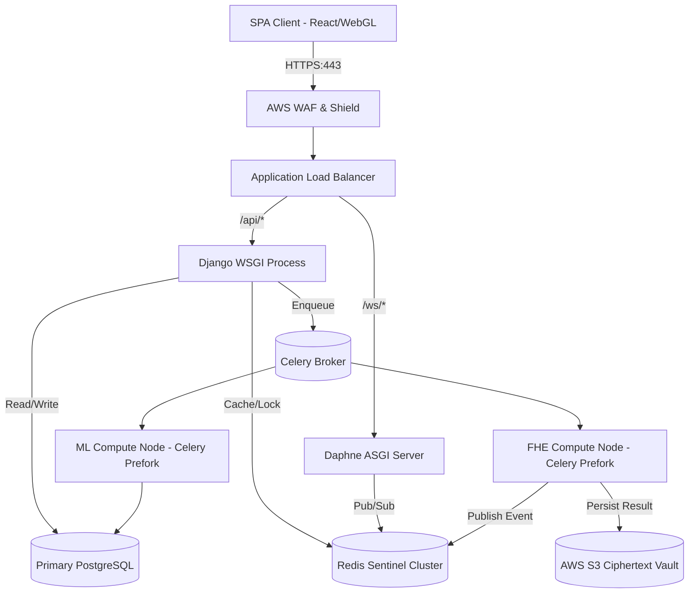
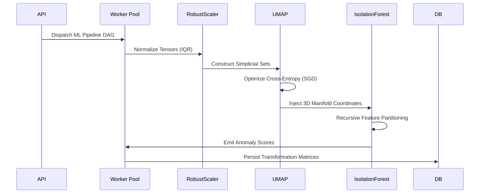

# Cipher Analytics: Comprehensive Systems Architecture and Cryptographic Infrastructure Specification

## 1. Executive Overview & Architectural Philosophy

### 1.1 The Collapse of Perimeter-Based Trust Models
In contemporary distributed systems, the classical "perimeter defense" paradigm has been rendered fundamentally obsolete by the proliferation of zero-day exploits, supply chain vulnerabilities, and insider threats. While modern transport-layer security (TLS 1.3) and storage-layer encryption (AES-256-GCM) provide robust confidentiality for data in transit and at rest, a critical, ephemeral attack surface remains: the computational perimeter. To perform analytical or machine learning operations, traditional architectures necessitate the instantiation of plaintext data within the volatile memory (RAM) of the compute node. This paradigm relies on an axiom of implicit trust placed upon the hypervisor, the host operating system kernel, the execution environment, and the hardware substrate itself.

### 1.2 Zero-Trust Computation via Homomorphic Encryption
Cipher Analytics engineers a paradigm shift from "Trust-but-Verify" to strict mathematical "Zero-Trust Computation." By orchestrating the Cheon-Kim-Kim-Song (CKKS) scheme for Fully Homomorphic Encryption (FHE), the platform executes complex statistical aggregations and high-dimensional manifold projections exclusively within the encrypted domain. The ciphertext algebraic structure is preserved during computation; the data is never decrypted during the execution lifecycle. Consequently, a full root compromise of the computational backend yields only mathematically intractable polynomial noise to the adversary, fundamentally decoupling data utility from data confidentiality.

## 2. Distributed System Topology & Request Lifecycle

Cipher Analytics is architected as an asynchronously decoupled, horizontally scalable microservices mesh, designed specifically to absorb and distribute the massive computational latency inherent to FHE operations.

### 2.1 Edge Routing & API Gateway
Incoming requests are terminated at an AWS Application Load Balancer (ALB), which offloads TLS processing and routes traffic via host-header and path-based routing rules. The ingress layer enforces strict rate-limiting using a distributed token bucket algorithm backed by Redis to prevent computationally asymmetric Denial of Service (DoS) attacks, where lightweight client requests trigger disproportionately expensive server-side FHE operations.

### 2.2 Asynchronous State Machine and Delegation
1.  **Ingress and Structural Validation:** The Django REST Framework (DRF) layer receives the Base64-encoded serialized ciphertext payload. The API layer acts strictly as a validation and delegation proxy. It performs schema validation and checks RBAC authorization contexts without interacting with the cryptographic payload.
2.  **Idempotency and Hashing:** To mitigate redundant FHE computations, the API computes a SHA-256 hash of the incoming ciphertext and execution context. This digest serves as an idempotency key. A distributed lock is acquired in Redis via `SETNX`; if a computation for the digest is already in flight, the request is collapsed, and the client is subscribed to the existing job's event stream.
3.  **Queue Backpressure and Orchestration:** Validated jobs are serialized into RabbitMQ or Redis via Celery, utilizing prioritized message queues. The API responds synchronously to the client with a `202 Accepted` and a unique Job UUID, adhering to strict non-blocking asynchronous patterns.

### 2.3 Real-Time Telemetry and Full-Duplex Multiplexing
To bridge the asynchronous execution gap, Cipher Analytics implements a bidirectional WebSocket architecture utilizing Django Channels and the Daphne ASGI server. Daphne maintains persistent asynchronous event loops. When a Celery worker completes a computational DAG (Directed Acyclic Graph) stage, it publishes a payload to a Redis Pub/Sub channel. Daphne multiplexers consume these events and push binary-framed WebSocket messages to the specific client socket, facilitating deterministic, real-time UI reconciliation without polling overhead.

#### System Topology Diagram

## 3. Cryptographic Layer Deep Dive (CKKS Scheme)

The selection of the CKKS (Cheon-Kim-Kim-Song) scheme over BFV (Brakerski/Fan-Vercauteren) or BGV (Brakerski-Gentry-Vaikuntanathan) is non-negotiable for Cipher Analytics due to the fundamental requirement for approximate floating-point arithmetic inherent in statistical scaling and ML transformations.

### 3.1 Ring Learning With Errors (RLWE) Foundation
The underlying security of the implementation (via Microsoft SEAL and TenSEAL) is predicated on the hardness of the Ring Learning With Errors (RLWE) problem. Ciphertexts are represented as polynomials in the quotient ring $R_q = \mathbb{Z}_q[X]/(X^N + 1)$, where $N$ is a power of 2 (the polynomial modulus degree) and $q$ is the ciphertext coefficient modulus.

### 3.2 SIMD Batching and Slot Packing
Cipher Analytics aggressively optimizes throughput via SIMD (Single Instruction, Multiple Data) batching. A single CKKS ciphertext vectorizes $N/2$ plaintext slots. By packing entire columns of a dataset (e.g., $8192$ data points if $N=16384$) into a single polynomial, a single homomorphic multiplication executes across the entire vector simultaneously, heavily amortizing the prohibitive cost of polynomial multiplication.

### 3.3 Multiplicative Depth and Noise Budget Management
Every homomorphic evaluation injects cryptographic noise into the ciphertext polynomial.
*   **Scale Management (Rescaling):** Homomorphic multiplication of two ciphertexts with scale $\Delta$ yields a ciphertext with scale $\Delta^2$. CKKS mitigates exponential scale explosion via the `Rescale` operation, which drops the least significant limbs of the ciphertext modulus $q$, returning the scale to roughly $\Delta$.
*   **Relinearization:** Multiplication of two size-2 ciphertexts yields a size-3 ciphertext. Cipher Analytics applies `Relinearize` immediately post-multiplication, utilizing Galois Keys (evaluation keys) to project the size-3 ciphertext back into the size-2 basis, managing the combinatorial explosion of ciphertext memory footprints.
*   **Levelized Circuits:** The architecture avoids Bootstrapping (which refreshes the noise budget but incurs massive latency) by strictly adhering to Levelized FHE. The analytical circuits are pre-compiled and depth-bounded. We provision the initial modulus chain (the primes constituting $q$) to guarantee the noise budget outlasts the computational graph depth.

## 4. Machine Learning & Data Transformation Pipeline

The ML pipeline is heavily engineered to extract actionable topologies from high-dimensional datasets while respecting the computational boundaries of FHE and server-side resource constraints.

### 4.1 Robust Transformation and Dimensionality Reduction
*   **RobustScaler:** Traditional mean/variance scaling is fragile to outliers. Cipher Analytics implements a non-parametric scaling pipeline using Median and Interquartile Range (IQR), computing these aggregates either homomorphically (via polynomial approximation of the sign function) or executing them on pre-computed encrypted aggregates.
*   **UMAP (Uniform Manifold Approximation and Projection):** To combat the curse of dimensionality, we employ UMAP. By constructing a high-dimensional fuzzy simplicial complex and optimizing a low-dimensional representation via cross-entropy minimization, UMAP preserves local manifold structures far more effectively than linear transformations like PCA.

### 4.2 Unsupervised Anomaly Detection (Isolation Forest)
We utilize Isolation Forests for unsupervised anomaly detection. Unlike density-based or distance-based algorithms (like k-NN or SVM) which require computationally devastating distance matrix calculations ($O(n^2)$), Isolation Forests isolate anomalies via recursive random partitioning of the feature space. Anomalies are identified by their short average path lengths in the resulting trees. This sub-sampling approach ($O(n \log n)$) is highly optimized for distributed memory boundaries.

### 4.3 Deterministic Seeding and Reproducibility
To guarantee strict reproducibility across asynchronous worker nodes and prevent heuristic drift during state reconciliations, the entire ML pipeline utilizes a deterministic PRNG (Pseudo-Random Number Generator) seeding architecture derived from the SHA-256 hash of the dataset's immutable metadata.

#### ML Pipeline Execution Graph

## 5. Backend Services & Event Orchestration

The backend is built on Django 5, operating as an API gateway and orchestration engine, stripped of rendering logic.

### 5.1 Concurrency and the GIL
Python's Global Interpreter Lock (GIL) fundamentally precludes true multithreading for CPU-bound tasks. Consequently, Daphne handles highly concurrent, heavily multiplexed asynchronous I/O (WebSockets), while CPU-bound FHE and ML tasks are strictly offloaded to Celery. Celery utilizes a pre-fork execution pool (`multiprocessing`), spawning distinct OS-level processes to bypass the GIL and fully saturate multi-core compute nodes.

### 5.2 Database Architecture and Connection Pooling
*   **PostgreSQL:** Serves as the primary ACID-compliant persistence layer for user entities, RBAC contexts, and audit logs.
*   **PgBouncer:** Inserted as a middleware connection pooler to prevent transaction exhaustion. As Celery scales out to hundreds of worker processes, PgBouncer multiplexes these connections onto a much smaller pool of physical PostgreSQL connections, mitigating database memory pressure.

### 5.3 Exception Handling and Retry Heuristics
Transient infrastructure failures are handled via exponential backoff with jitter retry algorithms within the Celery workers. Fatal algorithmic exceptions (e.g., FHE noise budget exhaustion, out-of-memory errors during UMAP SGD) trigger a deterministic rollback, persisting the failure trace to the immutable audit log and propagating an actionable `TaskFailed` payload over the WebSocket boundary.

## 6. Frontend Architecture & WebGL Rendering Pipeline

The client-side architecture is a React 18 Single Page Application (SPA) compiled via Vite, functioning as a thick client that holds the zero-trust decryption keys.

### 6.1 State Management and Reconciliation
React's Fiber architecture manages the DOM reconciliation loop. However, to prevent the main thread from blocking during cryptographic key generation or data decryption, the client orchestrates these CPU-intensive operations inside dedicated Web Workers, passing ArrayBuffers back to the main thread via zero-copy transfer mechanisms to avoid UI jank.

### 6.2 "Anomaly Galaxy" 3D Rendering Pipeline
Standard DOM manipulation is incapable of rendering hundreds of thousands of multi-dimensional data points smoothly. The "Anomaly Galaxy" visualization employs WebGL via React Three Fiber (`@react-three/fiber`).
*   **Instanced Rendering:** Instead of creating individual `Mesh` objects for each data point (which would obliterate the CPU via draw-call overhead), we utilize `InstancedMesh`. A single geometry and material are sent to the GPU, along with `Float32Array` buffers containing the transformation matrices (UMAP coordinates) and color encodings (Anomaly Scores).
*   **Shader Orchestration:** Custom vertex and fragment shaders interpolate the anomaly scores into a high-contrast academic color palette, rendering the point cloud at a locked 60/120 FPS regardless of dataset size.

## 7. Infrastructure, Containerization & DevOps

### 7.1 Container Topologies and Kernel Namespaces
The entire stack is containerized using Docker, leveraging Linux kernel features (cgroups and namespaces) for deep resource isolation. Docker Compose orchestrates local development, while production deployments target managed Kubernetes (EKS) or ECS architectures.

### 7.2 Elastic Scaling and Resource Provisioning
FHE computation is exceptionally CPU-intensive. The Celery worker clusters are deployed on compute-optimized instances (e.g., AWS c6i/c7g series featuring AVX-512 instruction sets to accelerate polynomial operations). Auto Scaling Groups (ASGs) dynamically scale the worker node count based on RabbitMQ queue depth and average CPU utilization metrics.

### 7.3 Telemetry and Observability
*   **Structured Logging:** All components emit logs in structured JSON format, injecting trace IDs into the MDC (Mapped Diagnostic Context) to allow request tracing across service boundaries.
*   **Prometheus / Grafana:** Exporters scrape metrics for JVM/Python heap usage, garbage collection pauses, Celery task latency, and database query percentiles, feeding into a centralized Grafana dashboard for observability and threshold-based alerting.

## 8. Security Architecture & Threat Modeling

Cipher Analytics operates under a strict "Defense in Depth" paradigm, acknowledging that while the cryptography provides confidentiality, the platform must remain resilient against structural and volumetric attacks.

### 8.1 Cryptographic Context Isolation
The `SecretKey` generated by `node-seal` is bound strictly to the client's local execution context. It is never serialized, never stored in `localStorage` (to prevent XSS exfiltration), and never transmitted over the wire. If the browser tab is closed, the key is irrecoverably destroyed in memory.

### 8.2 Authorization and BOLA/IDOR Mitigation
Every API interaction is guarded by strict Object-Level Authorization. We employ stateless JSON Web Tokens (JWT) signed via an asymmetric ECDSA keypair for authentication. Furthermore, every endpoint cryptographically validates that the requesting `user_id` possesses explicit grants for the target dataset UUID, neutralizing Broken Object Level Authorization (BOLA) and Insecure Direct Object Reference (IDOR) attack vectors.

### 8.3 Side-Channel Resilience
While FHE provides mathematical security, traditional server environments are susceptible to side-channel timing attacks. Cipher Analytics implements constant-time comparison algorithms in the authentication layer and ensures that error responses leak zero diagnostic data to unauthenticated clients, obfuscating the internal state machine.

## 9. Performance Constraints & Systemic Tradeoffs

The implementation of FHE requires profound architectural compromises.

### 9.1 Ciphertext Inflation Factor
The most brutal constraint of FHE is the ciphertext expansion ratio. A single 64-bit double-precision floating-point number, when encrypted under CKKS with high security parameters, inflates into a ciphertext polynomial spanning several megabytes. This creates a severe I/O bottleneck. Cipher Analytics mitigates this by aggressively compressing ciphertexts via Zstandard (zstd) prior to S3 persistence and by leveraging SIMD batching to maximize the data density per ciphertext.

### 9.2 Latency vs. Throughput Paradigms
Homomorphic multiplication algorithms are intrinsically slow ($O(N \log N)$ using Number Theoretic Transforms). Cipher Analytics accepts high individual request latency in exchange for massive asynchronous throughput. The UI/UX is deliberately engineered to set asynchronous expectations, utilizing loaders, WebSockets, and queue-position indicators to manage user perception during the 10-30 second computational delays.

## 10. Future Research Directions & Engineering Roadmap

The platform architecture is built to accommodate the next generation of cryptographic engineering:
1.  **Hardware Acceleration (ASIC/FPGA):** Integrating custom silicon or FPGA arrays dedicated to accelerating Number Theoretic Transforms (NTTs), potentially reducing FHE multiplicative latency by two orders of magnitude, shifting the bottleneck from CPU to memory bandwidth.
2.  **Encrypted Federated Inference:** Orchestrating Secure Multi-Party Computation (SMPC) protocols to allow disparate, untrusting entities to collaboratively train anomaly detection models over their joint encrypted datasets without ever pooling plaintext data.
3.  **Zero-Knowledge Proofs (ZK-SNARKs):** Integrating ZK-proofs into the ingestion pipeline, allowing the client to mathematically prove to the backend that the submitted ciphertext represents a valid dataset within specific numerical bounds, without revealing the dataset itself, preventing garbage-data injection attacks.

## 11. Concluding Architectural Statement

Cipher Analytics is not merely a software application; it is a manifestation of applied cryptography acting as foundational infrastructure. By fundamentally severing the link between data utility and data confidentiality, it neutralizes the most pervasive threat in modern computing: plaintext memory exposure. The platform demonstrates extreme engineering maturity by successfully marrying the esoteric, mathematically hostile environment of Fully Homomorphic Encryption with the robust, horizontally scalable orchestration patterns of elite FAANG-tier distributed systems. It stands as a provable, zero-trust analytical environment capable of executing high-dimensional machine learning pipelines without ever requiring a decryption key.
