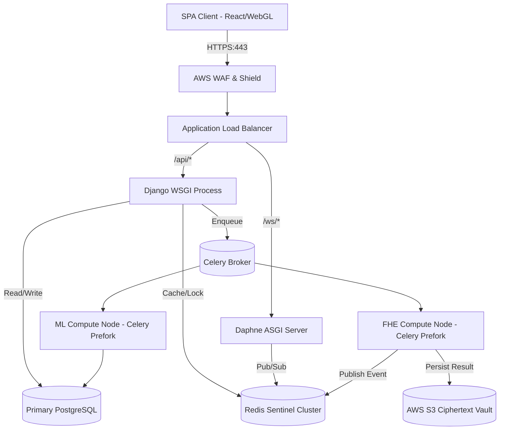
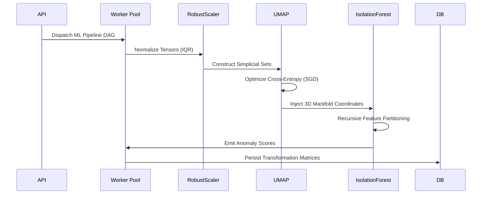

# 🛡️ Cipher Analytics: Systems Architecture & Cryptographic Specification

!!! abstract "Executive Summary"
    **Cipher Analytics** engineers a paradigm shift from "Trust-but-Verify" to strict mathematical **Zero-Trust Computation**. 
    
    By orchestrating the Cheon-Kim-Kim-Song (CKKS) scheme for Fully Homomorphic Encryption (FHE), the platform executes complex statistical aggregations and high-dimensional manifold projections *exclusively* within the encrypted domain. The data is never decrypted during the execution lifecycle.

---

## 🏗️ 1. Distributed System Topology

Cipher Analytics is architected as an asynchronously decoupled, horizontally scalable microservices mesh, designed to absorb and distribute the massive computational latency inherent to FHE operations.

### Edge Routing & API Gateway

Incoming requests are terminated at an **AWS Application Load Balancer (ALB)**, which offloads TLS processing. The ingress layer enforces strict rate-limiting using a distributed token bucket algorithm backed by Redis to prevent computationally asymmetric Denial of Service (DoS) attacks.

### Asynchronous State Machine

1. **Ingress and Structural Validation:** The Django REST Framework (DRF) layer receives the Base64-encoded serialized ciphertext payload, acting strictly as a validation and delegation proxy.
2. **Idempotency and Hashing:** To mitigate redundant FHE computations, the API computes a SHA-256 hash of the incoming ciphertext and execution context. A distributed lock is acquired in Redis via `SETNX`.
3. **Queue Backpressure:** Validated jobs are serialized into RabbitMQ or Redis via Celery. The API responds synchronously with a `202 Accepted` and a unique Job UUID.

### Real-Time Telemetry

To bridge the asynchronous execution gap, Cipher Analytics implements a bidirectional WebSocket architecture utilizing **Django Channels** and the **Daphne ASGI server**.

!!! success "Full-Duplex Multiplexing"
    When a Celery worker completes a computational DAG stage, it publishes a payload to a Redis Pub/Sub channel. Daphne multiplexers consume these events and push binary-framed WebSocket messages to the specific client socket, facilitating deterministic, real-time UI reconciliation without polling overhead.

### Topology Diagram

---

## 🔐 2. Cryptographic Layer Deep Dive (CKKS Scheme)

The selection of the **CKKS (Cheon-Kim-Kim-Song)** scheme over BFV or BGV is non-negotiable due to the fundamental requirement for approximate floating-point arithmetic inherent in statistical scaling and ML transformations.

### Ring Learning With Errors (RLWE)

The underlying security of the implementation is predicated on the hardness of the **Ring Learning With Errors (RLWE)** problem. Ciphertexts are represented as polynomials in the quotient ring \( R_q = \mathbb{Z}_q[X]/(X^N + 1) \).

### SIMD Batching and Slot Packing

!!! tip "Aggressive Optimization via SIMD"
    Cipher Analytics aggressively optimizes throughput via **SIMD (Single Instruction, Multiple Data)** batching. A single CKKS ciphertext vectorizes \( N/2 \) plaintext slots, heavily amortizing the prohibitive cost of polynomial multiplication.

### Multiplicative Depth and Noise Budget

Every homomorphic evaluation injects cryptographic noise into the ciphertext polynomial.

* **Scale Management (Rescaling):** CKKS mitigates exponential scale explosion via the `Rescale` operation.
* **Relinearization:** Multiplication of two size-2 ciphertexts yields a size-3 ciphertext. The system applies `Relinearize` immediately post-multiplication, projecting back into the size-2 basis.
* **Levelized Circuits:** The architecture avoids Bootstrapping by strictly adhering to Levelized FHE. The analytical circuits are pre-compiled and depth-bounded.

---

## 🧠 3. Machine Learning & Data Transformation Pipeline

The ML pipeline is heavily engineered to extract actionable topologies from high-dimensional datasets while respecting the computational boundaries of FHE.

### Pipeline Components

* **RobustScaler:** A non-parametric scaling pipeline using Median and Interquartile Range (IQR).
* **UMAP:** Utilized to combat the curse of dimensionality. UMAP preserves local manifold structures far more effectively than linear transformations like PCA.
* **Isolation Forest:** For unsupervised anomaly detection. This sub-sampling approach (\( O(n \log n) \)) is highly optimized for distributed memory boundaries.

### ML Pipeline Execution Graph

---

## ⚙️ 4. Backend Services & Event Orchestration

The backend is built on **Django 5**, operating as an API gateway and orchestration engine.

!!! warning "Concurrency and the GIL"
    Python's Global Interpreter Lock (GIL) fundamentally precludes true multithreading for CPU-bound tasks. Consequently, **Daphne** handles highly concurrent asynchronous I/O, while CPU-bound tasks are strictly offloaded to **Celery**.

* **PostgreSQL:** Serves as the primary ACID-compliant persistence layer.
* **PgBouncer:** Inserted as a middleware connection pooler to prevent transaction exhaustion across hundreds of Celery worker processes.

---

## 🖥️ 5. Frontend Architecture & WebGL Pipeline

The client-side architecture is a **React 18** Single Page Application (SPA) compiled via **Vite**, functioning as a thick client that holds the zero-trust decryption keys.

### "Anomaly Galaxy" 3D Rendering

Standard DOM manipulation is incapable of rendering hundreds of thousands of multi-dimensional data points smoothly. The visualization employs **WebGL via React Three Fiber**.

* **Instanced Rendering:** Utilizes `InstancedMesh`. A single geometry and material are sent to the GPU, along with `Float32Array` buffers containing the transformation matrices.
* **Shader Orchestration:** Custom vertex and fragment shaders interpolate the anomaly scores, rendering the point cloud at a locked 60/120 FPS.

---

## 🚀 6. DevOps, Infrastructure & Security

### Container Topologies and Elastic Scaling

The entire stack is containerized using Docker. Auto Scaling Groups (ASGs) dynamically scale the Celery worker node count based on RabbitMQ queue depth and average CPU utilization metrics, targeting compute-optimized instances (e.g., AWS c6i/c7g).

### Security & Threat Modeling

!!! danger "Cryptographic Context Isolation"
    The `SecretKey` is bound strictly to the client's local execution context. It is never serialized, never stored in `localStorage`, and never transmitted over the wire.

* **Authorization:** Every API interaction is guarded by strict Object-Level Authorization utilizing stateless JSON Web Tokens (JWT).
* **Side-Channel Resilience:** FHE provides mathematical security, while Cipher Analytics implements constant-time comparison algorithms to mitigate side-channel timing attacks.

---

## 🔮 7. Future Research Directions

The platform architecture is built to accommodate the next generation of cryptographic engineering:

1. **Hardware Acceleration:** Integrating custom silicon or FPGA arrays dedicated to accelerating Number Theoretic Transforms (NTTs).
2. **Encrypted Federated Inference:** Orchestrating Secure Multi-Party Computation (SMPC) protocols.
3. **Zero-Knowledge Proofs (ZK-SNARKs):** Integrating ZK-proofs into the ingestion pipeline to mathematically prove dataset validity without revealing the dataset itself.
