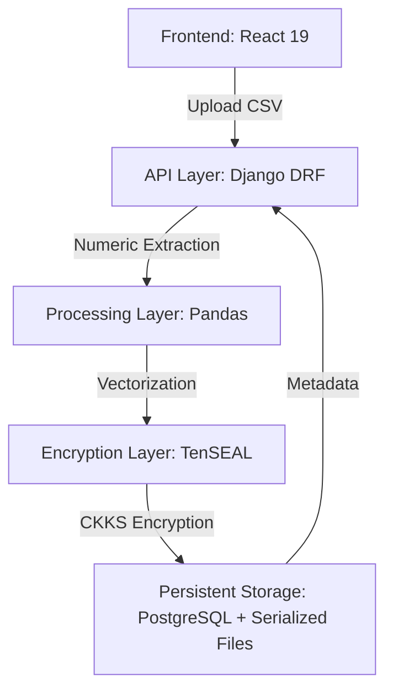

# Cipher Analytics

## Overview
Cipher Analytics is a privacy-preserving data processing platform designed to enable statistical analysis on sensitive numeric datasets without disclosing the underlying raw values to the server. By leveraging Homomorphic Encryption (HE), the system maintains data confidentiality throughout the entire storage and computation lifecycle.

The project demonstrates an applied implementation of the CKKS encryption scheme within a modern web architecture, bridging the gap between theoretical cryptography and functional backend systems.

## Problem
In traditional data processing architectures, servers must decrypt data to perform any form of arithmetic or statistical computation. This "decryption-to-compute" paradigm introduces several critical failure points:
- **Memory Exposure**: Plaintext data exists in server RAM, making it vulnerable to memory scraping or side-channel attacks.
- **Insider Threats**: Privileged system administrators can access raw sensitive information.
- **Regulatory Risk**: Handling plaintext sensitive data increases the complexity of GDPR, HIPAA, and CCPA compliance.

## Solution
Cipher Analytics addresses these vulnerabilities by adopting a "compute-on-encrypted-data" model. Instead of decrypting data for analysis, the system performs operations directly within the encrypted domain. Raw values are transformed into encrypted vectors before they ever reach persistent storage, ensuring that the backend services interact only with opaque cryptographic noise while still retaining the ability to perform meaningful mathematical operations.

## Architecture

### Layers
- **Frontend**: Handles secure file selection and project management interfaces.
- **Service Layer**: Decouples API logic from cryptographic operations, ensuring the core business logic remains agnostic of the underlying HE implementation.
- **Cryptographic Engine**: Uses TenSEAL to manage encryption contexts and perform homomorphic operations.
- **Storage Strategy**: Combines relational metadata for discovery and serialized encrypted blobs for the actual data payloads.

## Encryption Model
The system utilizes the **CKKS (Cheon-Kim-Kim-Song)** scheme, a leveled homomorphic encryption method designed for approximate arithmetic on complex numbers or real numbers.

### Rationale
CKKS was selected over BGV or BFV because it natively supports floating-point operations, which are essential for statistical analytics (means, standard deviations, etc.). While it introduces a controlled amount of noise (approximation), the trade-off is necessary for high-performance mathematical computation on encrypted vectors.

### Key Parameters
- **Poly Modulus Degree**: `8192` (Balanced security and performance)
- **Coeff Modulus**: `[60, 40, 40, 60]`
- **Scale**: `2^40` (Ensures precision during multiple operations)

## Data Flow
1. **Ingestion**: User uploads a numeric CSV through the authenticated React interface.
2. **Validation**: Django backend validates schema and authenticates the user context.
3. **Preprocessing**: Pandas extracts specific numeric features and handles missing values.
4. **Encryption**: TenSEAL converts row-wise vectors into CKKS-encrypted ciphertexts.
5. **Persistence**: Encrypted objects are serialized via Pickle and stored as binary files, with metadata tracked in PostgreSQL.

## Key Engineering Decisions
- **Service Layer Pattern**: All cryptographic logic is encapsulated within a dedicated service layer. This prevents "leaking" encryption details into the REST views and allows for easier swapping of HE schemes in the future.
- **TenSEAL Wrapper**: TenSEAL was chosen as the C++ SEAL interaction layer due to its efficient vectorization support and seamless integration with the Python ecosystem.
- **Backend-Heavy Design**: Security transformations are centralized in the backend to maintain strict control over the encryption context, though this necessitates a high-trust relationship with the server in the current iteration.

## Limitations
- **Aggregation Gap**: The current implementation focuses on secure storage and retrieval; homomorphic aggregation (sum, mean) is documented as a roadmap item rather than a production feature.
- **Context Security**: The encryption context is currently managed on-disk, which is insufficient for high-security production environments requiring Hardware Security Modules (HSMs).
- **Server Trust**: Because the backend handles the encryption context, it is a "trusted server" model rather than a "zero-trust" model.
- **Domain Constraint**: The system is strictly limited to numeric data; categorical or string-based operations are not supported.

## Future Improvements
- **Differential Privacy Integration**: Layering differential privacy on top of HE to prevent information leakage from computation results.
- **Asymmetric Client-Side Encryption**: Enabling users to encrypt data locally before transmission, achieving a true zero-trust architecture.
- **Distributed Processing**: Implementing background worker queues (Celery) to handle the significant computational overhead of HE operations on large datasets.

## Why This Project Matters
Cipher Analytics moves beyond traditional CRUD applications by tackling the fundamental tension between data utility and data privacy. It demonstrates that privacy-first engineering is not just about perimeter security or access control, but about re-architecting how data is fundamentally handled throughout its lifecycle.

## Repository
[Cipher Analytics GitHub Repository](https://github.com/ashif-ek/cipher-analytics)
