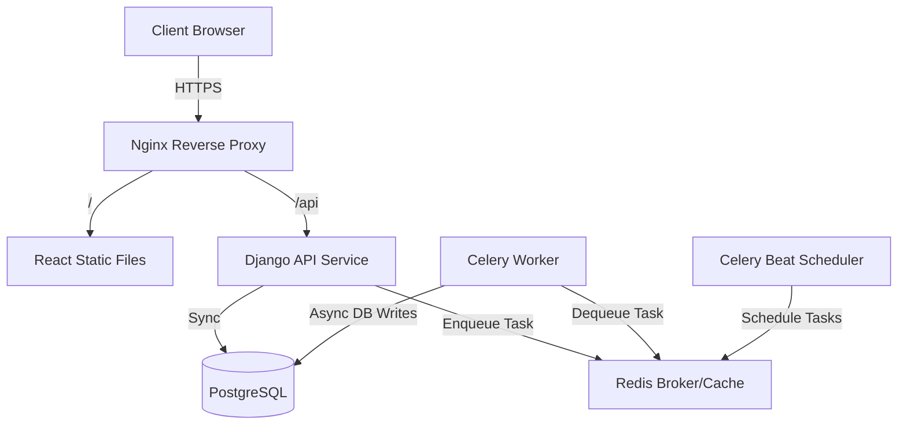
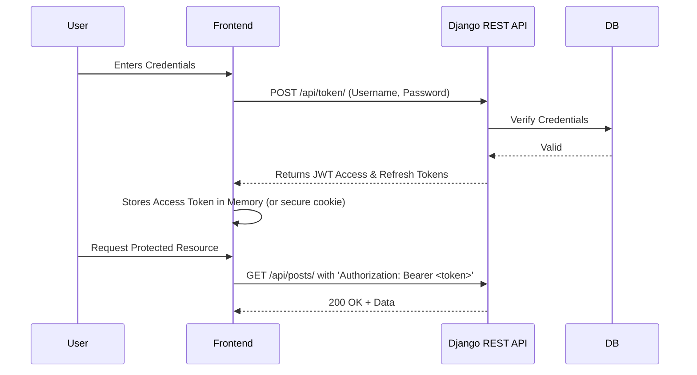

# Content Publishing Engine

**An enterprise-grade, microservice-ready content management platform built on Django, Celery, and React.**

- **Version**: 2.0.0
- **Author**: Ashif EK
- **Tech Stack**: Django REST Framework, Celery, Redis, React, Vite, Nginx, Docker
- **Status**: Production-Ready
- **Last Updated**: 2026-05-25

---

## 1. Executive Summary

### Business Problem
Modern publishing platforms need to handle not just basic CRUD operations, but also async workflows (like email notifications, thumbnail generation, and analytics aggregation). Monolithic synchronous approaches block the main execution thread, leading to poor User Experience (UX) during heavy operations.

### Engineering Problem
Implementing a scalable architecture that decouples background tasks from the main request-response cycle while maintaining strict security perimeters (JWT) and high-performance caching (Redis) is challenging but necessary for high-throughput systems.

### Why This Project Exists
The `Content Publishing Engine` is a reference implementation of a robust, async-capable monolithic API. It demonstrates how to integrate Django with a distributed task queue (Celery/Redis) and serve a decoupled React frontend using an Nginx reverse proxy.

### Goals
- **Technical Goals**: Decouple the frontend from the backend entirely. Implement an asynchronous worker queue for background processing.
- **Scalability Goals**: Containerize all services to allow independent horizontal scaling of the API and Celery workers.
- **Security Goals**: Secure API endpoints via stateless JSON Web Tokens (JWT) and enforce strict CORS policies.

---

## 2. System Overview

### High-Level Architecture
The platform is structured as a decoupled ecosystem. The frontend is a static React application served via Nginx, which also acts as a reverse proxy routing API requests to the backend. The backend is a Django REST Framework (DRF) application that offloads heavy computations to Celery workers via Redis.

### Major Modules
- **Web Frontend**: React SPA bundled with Vite, served by Nginx.
- **API Gateway/Proxy**: Nginx directing `/api` traffic to Gunicorn.
- **Core API Service**: Django + DRF handling business logic and ORM operations.
- **Task Broker & Cache**: Redis.
- **Async Workers**: Celery workers executing deferred tasks.
- **Scheduler**: Celery Beat for periodic cron jobs.

### Data Flow
1. User requests page -> Nginx serves static assets.
2. User authenticates -> Nginx proxies to Django -> Django issues JWT.
3. User creates a post -> Django saves to DB and queues a "send notification" task to Redis.
4. Celery Worker picks up the task from Redis and processes it asynchronously.

---

## 3. Architecture Diagrams

### System Architecture



### Authentication Flow



---

## 4. Component & State Architecture (Frontend)

### Purpose
The React frontend is designed for rapid content delivery, utilizing Vite for optimized bundling and a component-based architecture for reusability.

### Internal Working
- **Routing**: Client-side routing maps URLs to view components.
- **State Management**: Centralized state manages the active user session and loaded content feeds.
- **Interceptors**: Axios interceptors automatically attach the JWT access token to outbound requests and handle 401 Unauthorized responses by attempting a token refresh.

### Performance Implications
Using Nginx to serve the built static files ensures sub-millisecond response times for the UI shell. 

---

## 5. API Documentation

### Token Authentication
- **Endpoint**: `POST /api/token/`
- **Purpose**: Obtain JWT pairs.
- **Request Body**:
```json
{
  "username": "admin",
  "password": "securepassword"
}
```
- **Response**:
```json
{
  "refresh": "eyJhbG...",
  "access": "eyJhbG..."
}
```

### Content Publishing
- **Endpoint**: `POST /api/posts/`
- **Purpose**: Create a new blog post.
- **Auth**: Required (`Bearer <token>`)
- **Request Body**:
```json
{
  "title": "Scaling Django",
  "content": "To scale Django, we must decouple...",
  "status": "published"
}
```

---

## 6. Database Documentation

### Schema Overview
The underlying relational database uses the standard Django ORM (PostgreSQL recommended for production).

- **`User` Table**: Extends AbstractUser for authentication.
- **`Post` Table**: Contains text fields, author ForeignKeys, and timestamps.
- **Relationships**: A User has a 1-to-many relationship with Posts.

### Scaling Considerations
To prevent N+1 query problems in DRF, `select_related` and `prefetch_related` must be aggressively utilized in viewsets when fetching feeds.

---

## 7. Security Documentation

### JWT Security
- **Access Tokens**: Short-lived (e.g., 5-15 minutes).
- **Refresh Tokens**: Long-lived, stored securely.
- **XSS/CSRF**: Because the frontend operates on a decoupled domain (or via proxy), CSRF tokens are bypassed in favor of the `Authorization` header. To mitigate XSS, tokens should ideally be stored in `HttpOnly` cookies, though memory storage is acceptable if XSS vectors are strictly sanitized.

---

## 8. Backend Documentation

### Service Layer & Background Jobs
- **Celery Integration**: Heavy operations, such as sending welcome emails to new users or aggregating daily metrics, are wrapped in `@shared_task`.
- **Worker Configuration**: The `docker-compose.yml` configures workers with specific queues (`high_priority`, `default`, `low_priority`) and a concurrency of 2.

---

## 9. DevOps Documentation

### Docker Setup
The project relies heavily on `docker-compose.yml` for local orchestration:
1. **api**: Builds the backend image, maps port 8000.
2. **worker**: Builds the backend image but overrides the command to run `celery worker`.
3. **beat**: Runs `celery beat` for chron-based scheduling.
4. **redis**: Uses the lightweight `redis:7-alpine` image.

### Production Deployment
In production (`docker-compose.prod.yml`), the Django development server is replaced by Gunicorn, and static files are collected into a volume shared with the Nginx container.

---

## 10. Advanced Engineering Insights

> [!WARNING]
> **Celery Result Backend Memory Leak**
> By default, if a Celery result backend is configured, task results are stored indefinitely in Redis unless explicitly ignored or expired.
> 
> **Resolution**: Ensure `@shared_task(ignore_result=True)` is used for tasks where the return value is not needed, or configure `CELERY_RESULT_EXPIRES` in `settings.py` to prevent Redis memory eviction issues in production.
