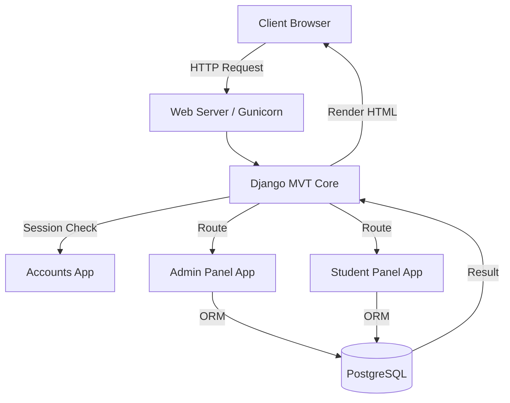
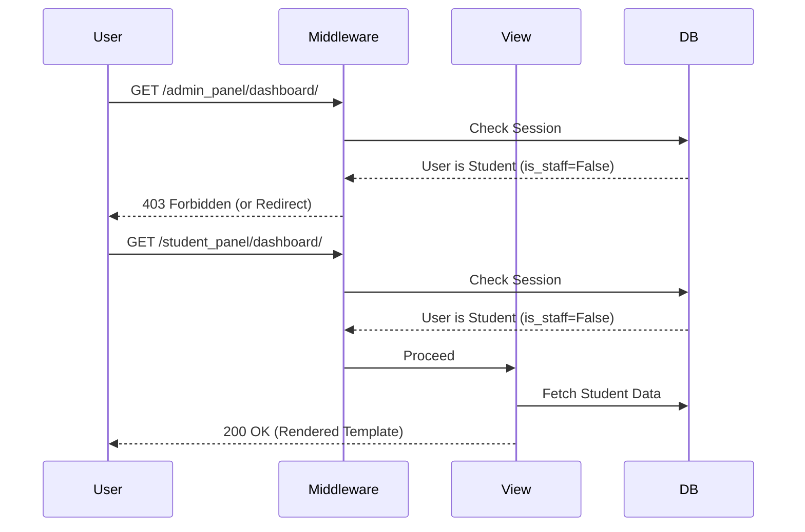

# Edu-Management System

**A monolithic, multi-tenant educational platform built on Django, featuring role-based dashboards and course orchestration.**

- **Version**: 1.5.0
- **Author**: Ashif EK
- **Tech Stack**: Django (MVT), PostgreSQL, HTML5/CSS3, JavaScript
- **Status**: Production-Ready
- **Last Updated**: 2026-05-25

---

## 1. Executive Summary

### Business Problem
Educational institutions struggle with fragmented software where student onboarding, course enrollments, and administrative oversight exist in separate silos. This fragmentation increases administrative overhead and degrades the student experience.

### Engineering Problem
Building a centralized platform requires strict Role-Based Access Control (RBAC) to ensure students cannot access administrative panels, while keeping the database schema normalized enough to handle complex many-to-many relationships (Students <-> Courses) efficiently.

### Why This Project Exists
The `Edu-Management System` provides a unified, monolithic architecture that handles authentication, course management, and administrative dashboards within a single repository, ensuring data integrity and rapid feature iteration.

### Goals
- **Technical Goals**: Leverage Django's Model-View-Template (MVT) architecture for rapid server-side rendering (SSR).
- **Scalability Goals**: Maintain efficient query sets using `select_related` and `prefetch_related` to prevent database bottlenecks.
- **Security Goals**: Enforce strict session-based authentication and CSRF protection across all forms.

---

## 2. System Overview

### High-Level Architecture
The system is a traditional monolithic server-rendered web application. It intercepts HTTP requests, routes them to the appropriate view based on the user's role (Admin vs. Student), queries the PostgreSQL database via the Django ORM, and returns rendered HTML templates.

### Major Modules
- **`accounts`**: Custom User model and authentication logic.
- **`admin_panel`**: High-level CRUD interfaces for administrators.
- **`student_panel`**: Read-only and enrollment dashboards for students.
- **`courses_mgmt`**: Domain logic for course creation and prerequisites.
- **`student_mgmt`**: Domain logic for student profiles and grades.

### Data Flow
1. User requests a protected URL.
2. Django Middleware intercepts the request, verifying the session cookie.
3. The URL router directs the request to a Role-Restricted View.
4. The View queries the ORM for permitted data.
5. The ORM translates the query to SQL and fetches data from PostgreSQL.
6. The View injects the data into a Jinja2/Django Template.
7. HTML is returned to the client.

---

## 3. Architecture Diagrams

### System Architecture



### Role-Based Authorization Flow



---

## 4. Component Architecture (MVT)

### Purpose
The platform utilizes Server-Side Rendering (SSR) via Django Templates. This choice prioritizes SEO, initial load times, and simplifies state management by keeping it entirely on the server.

### Internal Working
- **Models**: Fat models containing business logic (e.g., `Course.get_enrollment_count()`).
- **Views**: Thin views, primarily Class-Based Views (CBVs) inheriting from `LoginRequiredMixin` and custom `RoleRequiredMixin`.
- **Templates**: Hierarchical template structure extending a base `layout.html`.

---

## 5. API Documentation

*(This project primarily relies on SSR, but includes internal endpoints for AJAX operations)*

### Course Enrollment (AJAX)
- **Endpoint**: `POST /courses/api/enroll/`
- **Purpose**: Asynchronously enroll a student in a course without reloading the page.
- **Auth**: Required + CSRF Token Header
- **Request Body**:
```json
{
  "course_id": 42
}
```
- **Response**:
```json
{
  "status": "success",
  "message": "Enrolled successfully."
}
```

---

## 6. Database Documentation

### Schema Overview
- **`User` Table**: Overrides `AbstractUser`. Includes `role` choices (ADMIN, STUDENT).
- **`Course` Table**: Contains `title`, `description`, `credits`, `instructor`.
- **`Enrollment` Table**: Junction table linking `User` and `Course` with extra fields (e.g., `enrollment_date`, `grade`).

### Scaling Considerations
The `Enrollment` table will grow exponentially. 
**Optimization**: Ensure composite indexes on `(student_id, course_id)` to speed up constraint checks (preventing double enrollment).

---

## 7. Security Documentation

### Built-in Protections
- **CSRF**: Every POST form includes ``.
- **SQL Injection**: Prevented entirely by strictly using the Django ORM; no raw SQL is executed.
- **XSS**: Django templates auto-escape HTML variables by default.
- **Session Security**: Cookies are flagged as `HttpOnly` and `Secure` in production.

---

## 8. Backend Documentation

### Middleware
Custom middleware ensures that users attempting to access URL namespaces (e.g., `/admin_panel/*`) have the correct database role flags.

### ORM Usage
Heavy usage of Django's `F()` objects to handle race conditions (e.g., atomic increments for course seat availability).

---

## 9. DevOps Documentation

### Environment Management
Configuration is managed via `python-decouple` and `.env` files, isolating secrets from the repository.

### Build Script
The `build.sh` script automates deployments on PaaS providers (like Render or Heroku):
```bash
python manage.py collectstatic --no-input
python manage.py migrate
```

---

## 10. Advanced Engineering Insights

> [!TIP]
> **Fat Models vs Thin Views**
> By pushing business logic into the Models (e.g., calculating GPAs directly via model properties), the views remain extremely clean and easily testable. This architectural pattern prevents logic duplication across different views and REST endpoints.
