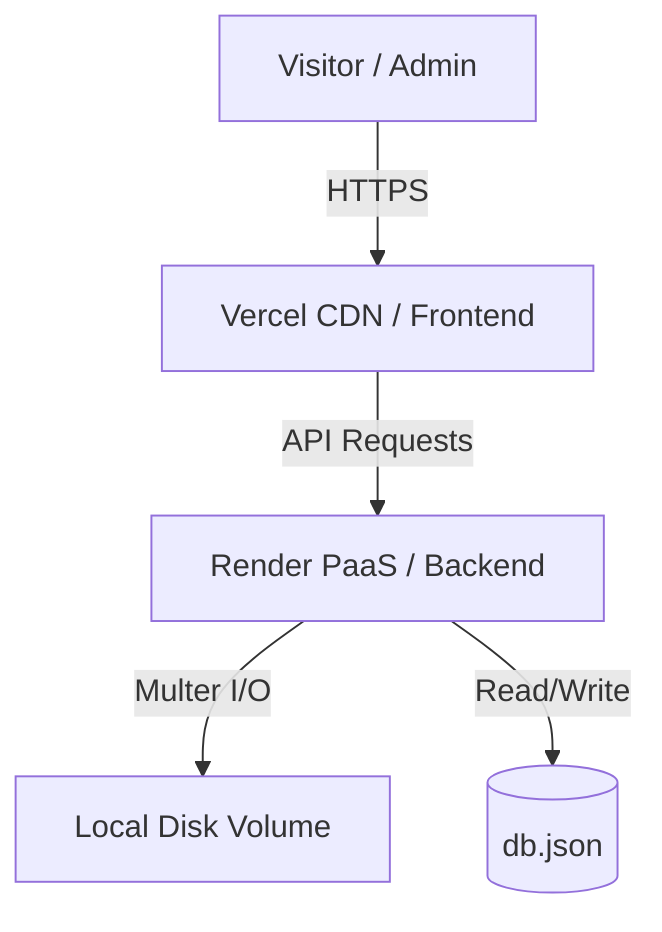
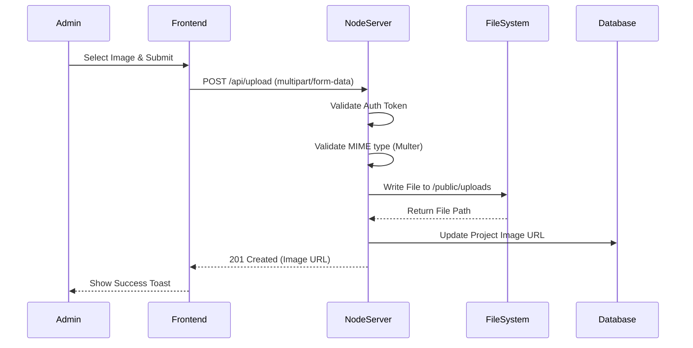

# Portfolio UI Platform

**A highly interactive, performance-optimized digital portfolio engine featuring a secure CMS and dynamic rendering.**

- **Version**: 2.1.0
- **Author**: Ashif EK
- **Tech Stack**: React 18, Vite, Framer Motion, Node.js (Custom JSON Server), Multer
- **Status**: Production-Ready
- **Last Updated**: 2026-05-25

---

## 1. Executive Summary

### Business Problem
Personal and professional portfolios often suffer from static obsolescence. Updating project showcases, skills, or resume links typically requires a code deployment, creating a bottleneck for continuous professional branding.

### Engineering Problem
Building a bespoke Content Management System (CMS) for a portfolio can lead to over-engineering. The challenge lies in creating a lightweight, highly responsive interface with a secure backend that allows dynamic content updates and media uploads without the overhead of a heavy RDBMS.

### Why This Project Exists
`Portfolio UI` solves this by merging a visually premium, Framer Motion-powered React frontend with a lightweight Node.js/JSON Server backend. It provides an immediate administrative dashboard for content management while maintaining a zero-runtime CSS (Tailwind v4) footprint on the public-facing site.

### Goals
- **Technical Goals**: Deliver 60fps animations utilizing hardware-accelerated CSS and Framer Motion. Achieve a near-perfect Lighthouse performance score.
- **Scalability Goals**: Implement Progressive Web App (PWA) capabilities for offline caching and mobile-native feel.
- **Security Goals**: Secure the admin dashboard and prevent unauthorized file uploads to the server block.

---

## 2. System Overview

### High-Level Architecture
The system employs a Headless CMS approach. The frontend is a static Vite build deployed to a CDN (e.g., Vercel), while the backend is a persistent Node.js process deployed on a PaaS (e.g., Render) managing a flat-file JSON database and disk-based media storage.

### Major Modules
- **Public View Layer**: React components showcasing the portfolio, projects, and contact forms.
- **Admin Dashboard**: Secured React routes for managing JSON data and viewing analytics.
- **Media Controller**: Node.js backend integrating `Multer` for multipart/form-data parsing.
- **Data Persistence**: Configured JSON server acting as a REST API.

### Data Flow
1. Visitor navigates to the public site.
2. The React frontend fetches `/api/projects` from the JSON Server.
3. Framer Motion animates the DOM nodes as data hydrates.
4. Administrator navigates to `/admin`.
5. Administrator authenticates; backend verifies `.env` credentials.
6. Administrator uploads a new project image.
7. Backend `Multer` middleware streams the image to the disk and updates the `db.json` reference.

---

## 3. Architecture Diagrams

### System Architecture



### Media Upload Flow



---

## 4. Component Architecture (React)

### Purpose
The component tree is strictly segregated between layout primitives, domain-specific features, and administrative interfaces.

### Internal Working
- **Framer Motion**: Complex orchestrations use `AnimatePresence` for unmounting animations and `useScroll` for parallax effects.
- **Context API**: Global state, specifically Dark/Light theme toggles and Auth state, is managed via React Context to avoid prop-drilling.
- **PWA Integration**: `vite-plugin-pwa` handles Service Worker registration and caching strategies (stale-while-revalidate).

---

## 5. API Documentation

### Content Fetching
- **Endpoint**: `GET /api/projects`
- **Purpose**: Retrieve the list of portfolio projects.
- **Query Params**: `?_sort=date&_order=desc`

### Admin Authentication
- **Endpoint**: `POST /api/auth/login`
- **Purpose**: Authenticate against environment variables.
- **Request Body**:
```json
{
  "username": "admin",
  "password": "***"
}
```

### Media Upload
- **Endpoint**: `POST /api/upload`
- **Purpose**: Handle image uploads via Multer.
- **Request Headers**: `Content-Type: multipart/form-data`
- **Security Concerns**: Requires strict file size limits and MIME-type validation to prevent shell script uploads.

---

## 6. Database Documentation

### Schema Overview
The flat-file database (`db.json`) structures data in standard collections:
- `projects`: Contains metadata, links, and image references.
- `skills`: Categorized arrays of technical competencies.
- `stats`: Administrative view metrics.

### Scaling Considerations
While JSON Server is excellent for low-write systems like a portfolio, concurrent admin writes could corrupt `db.json`. 
**Optimization**: If collaboration is needed, migrate to a document database like MongoDB or a managed CMS like Sanity.io.

---

## 7. Security Documentation

### Admin Protection
Authentication relies on comparing incoming payloads against `.env` variables (`ADMIN_USERNAME`, `ADMIN_PASSWORD`). While stateless, it is effective for single-user administration.

### File Upload Hardening
- **Multer Configuration**: Configured to reject non-image MIME types (e.g., `application/x-sh`).
- **Path Traversal**: File names are sanitized and appended with unique timestamps (`Date.now()`) to prevent directory traversal attacks and namespace collisions.

---

## 8. Frontend Documentation

### Styling Strategy
Tailwind CSS provides utility-first styling. The `tailwind.config.js` is extended with custom design tokens for glassmorphism (backdrop-blur) and gradients, ensuring a unified visual identity.

### Charts & Analytics
The administrative dashboard integrates `Recharts` for parsing and visualizing visitor data or project engagement metrics stored in the JSON backend.

---

## 9. DevOps Documentation

### Deployment Pipeline
- **Frontend (Vercel)**: Continuous Deployment triggered on pushes to the `main` branch. Environment variables define the `VITE_API_BASE_URL`.
- **Backend (Render)**: Deploys as a Web Service. A persistent disk volume must be attached to the `/server` directory to ensure `db.json` and `/uploads` survive container restarts.

---

## 10. Advanced Engineering Insights

> [!CAUTION]
> **Ephemeral File Systems**
> If the backend is deployed to a PaaS without persistent disk volumes (like Heroku's ephemeral filesystem), any images uploaded via the Admin Dashboard or changes made to `db.json` will be wiped during the next container cycle or sleep state.
> 
> **Resolution**: You must either attach a persistent volume block to your Render instance, or refactor the backend to push Multer uploads directly to AWS S3 and synchronize data to a hosted database provider (e.g., MongoDB Atlas).
