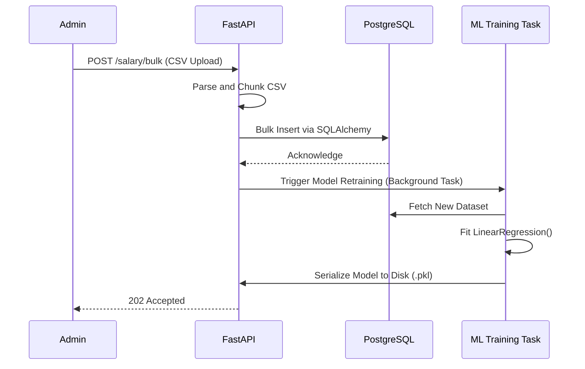

# Salary Analytics Engine

**An AI-powered data platform providing real-time market percentiles, predictive salary modeling, and fuzzy-matched data ingestion.**

- **Version**: 3.0.0
- **Author**: Ashif EK
- **Tech Stack**: FastAPI, PostgreSQL, SQLAlchemy, scikit-learn, React, Recharts
- **Status**: Production-Ready
- **Last Updated**: 2026-05-25

---

## 1. Executive Summary

### Business Problem
Salary transparency platforms rely on exact string matches for job titles and locations. If a user types "Sftware Enginr" or "BLR", traditional systems return empty states, resulting in a high bounce rate and poor data aggregation.

### Engineering Problem
Building a system that can instantaneously compute P10-P90 percentiles over millions of rows, gracefully handle misspelled inputs via fuzzy matching, and fallback to Machine Learning predictions (when data is sparse) requires a highly concurrent backend and optimized query execution.

### Why This Project Exists
The `Salary Analytics Engine` serves as a blueprint for combining traditional statistical analytics (SQL percentiles) with localized Machine Learning (scikit-learn linear regression). It demonstrates how to serve ML predictions synchronously within a high-throughput FastAPI application.

### Goals
- **Technical Goals**: Achieve sub-50ms API response times utilizing FastAPI's ASGI event loop and RapidFuzz for lightning-fast Levenshtein distance computations.
- **Scalability Goals**: Process bulk CSV uploads via chunked streaming to prevent server out-of-memory (OOM) exceptions.
- **Data Goals**: Automatically impute missing salary bands using trained regression models rather than presenting empty states.

---

## 2. System Overview

### High-Level Architecture
The architecture is bifurcated into a high-performance Python backend and a React-based data visualization frontend. The backend connects to PostgreSQL for structured storage and loads a serialized `scikit-learn` model into memory for real-time inference.

### Major Modules
- **FastAPI Core**: ASGI server handling concurrent HTTP requests.
- **Statistical Engine**: SQLAlchemy layer executing complex percentile aggregations directly within PostgreSQL.
- **Inference Engine**: In-memory `scikit-learn` Linear Regression model predicting salaries based on experience trends.
- **Fuzzy Matcher**: `RapidFuzz` layer normalizing incoming query strings (e.g., standardizing "banglore" to "Bangalore").
- **Visualization Client**: React SPA utilizing `Recharts` and `Framer Motion`.

### Data Flow
1. User queries "SDE 2 in Hyd, 4 yrs exp".
2. `RapidFuzz` normalizes the query to "Software Engineer II, Hyderabad".
3. FastAPI queries PostgreSQL for exact aggregations.
4. If statistical N < threshold (too few data points), FastAPI queries the Inference Engine.
5. FastAPI aggregates the statistical and predictive payload.
6. React hydrates the Recharts visualization.

---

## 3. Architecture Diagrams

### System Architecture

```mermaid
graph TD
    Client[React Dashboard]
    API[FastAPI Service]
    DB[(PostgreSQL)]
    Fuzzy[RapidFuzz Normalizer]
    ML[scikit-learn Model]

    Client -->|GET /insights| API
    API -->|1. Sanitize| Fuzzy
    Fuzzy --> API
    API -->|2. Aggregate| DB
    DB -->|Statistical Data| API
    API -->|3. Fallback (if sparse)| ML
    ML -->|Predicted Value| API
    API -->|JSON Payload| Client
```

### Data Pipeline Flow



---

## 4. Machine Learning Architecture

### Purpose
To provide utility even when absolute data points are missing. By training a linear regression model on experience vs. salary for specific normalized job titles, the system can mathematically predict standard compensation.

### Internal Working
- **Algorithm**: `sklearn.linear_model.LinearRegression`.
- **Features**: Years of Experience.
- **Target**: Annual Salary.
- **Lifecycle**: The model is serialized (pickled) and loaded into FastAPI's memory during the application startup event to ensure O(1) inference time.

---

## 5. API Documentation

### Insights Engine
- **Endpoint**: `GET /salary/insights`
- **Purpose**: Retrieve statistical percentiles (P10, P50, P90).
- **Query Parameters**:
  - `job_role` (string)
  - `city` (string)
  - `experience` (int)
- **Response**:
```json
{
  "normalized_role": "Software Engineer",
  "data_points": 1420,
  "percentiles": {
    "p10": 45000,
    "p50": 90000,
    "p90": 160000
  },
  "source": "statistical"
}
```

### Prediction Fallback
- **Endpoint**: `GET /salary/predict`
- **Purpose**: Force an ML prediction.
- **Response**:
```json
{
  "predicted_salary": 94500,
  "confidence_score": 0.82,
  "source": "machine_learning"
}
```

---

## 6. Database Documentation

### Schema Overview
- **`SalaryRecord` Table**:
  - `id`: UUID Primary Key
  - `normalized_title`: Indexed String
  - `city`: Indexed String
  - `experience_years`: Float
  - `annual_salary`: Numeric

### Scaling Considerations
Percentile calculations (`PERCENTILE_CONT`) are notoriously slow on large datasets.
**Optimization Strategy**: Implement materialized views for common queries (e.g., "Software Engineer in San Francisco") that refresh nightly via a pg_cron job.

---

## 7. Security Documentation

### Rate Limiting & Abuse Prevention
Because fuzzy matching and percentile queries are computationally expensive, the API endpoints must be protected behind strict rate limits (e.g., `slowapi` or Redis-based token buckets) to prevent Denial of Service (DoS) attacks.

---

## 8. Frontend Documentation

### Visualization Strategy
`Recharts` is utilized to render dynamic, responsive bar charts depicting the salary bell curve. `Framer Motion` handles layout shifts, ensuring that when the user toggles between "Monthly" and "Annual" views, the axes and bars animate fluidly rather than snapping abruptly.

---

## 9. DevOps Documentation

### ASGI Deployment
FastAPI is served via Uvicorn workers managed by Gunicorn in production.
```bash
gunicorn app.main:app -w 4 -k uvicorn.workers.UvicornWorker -b 0.0.0.0:8000
```
This multi-worker setup ensures that synchronous CPU-bound tasks (like loading the ML model) do not block the ASGI event loop for concurrent HTTP requests.

---

## 10. Advanced Engineering Insights

> [!TIP]
> **Database-level vs. Python-level Percentiles**
> When computing percentiles, pulling all rows into Python memory and utilizing `numpy.percentile()` will lead to catastrophic memory exhaustion.
> 
> **Resolution**: This platform correctly utilizes PostgreSQL's native window functions (`percentile_cont(0.5) WITHIN GROUP (ORDER BY annual_salary)`) to offload the heavy lifting to the database layer, ensuring the Python worker remains memory-efficient.
