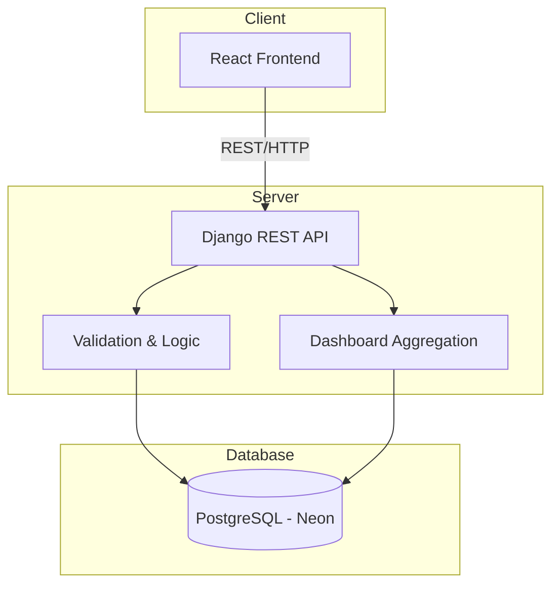

# SkillStack

SkillStack is a personal learning tracker for managing learning goals, tracking progress and learning activity, and viewing useful learning insights. It helps you stay organized and motivated by keeping a detailed log of your educational journey.

## Live Application

- **Frontend**: [https://ashif-skill-stack.vercel.app/](https://ashif-skill-stack.vercel.app/)
- **Backend API**: [https://skill-stack-production-6c9b.up.railway.app/api](https://skill-stack-production-6c9b.up.railway.app/api)

## Architecture & Visual Flow

## Features

- **Create and Manage Learning Goals**: Track what you want to learn.
- **Track Progress and Status**: Keep track of the completion status (Started, In Progress, Completed) and overall progress (0-100%).
- **Detailed Goal Information**: Record resource type, platform, URL, category, difficulty, and notes for each goal.
- **Log Learning Activities**: Record individual learning sessions with specific dates, hours spent, and personal notes.
- **Dashboard Statistics**: View aggregated data including total skills, completed skills, skills in progress, and total learning hours.
- **Category-wise Learning Hours**: See a breakdown of time spent across different learning categories.
- **Learning Pulse**: Get an overview of your momentum based on learning activity over the last 7 days.

## Tech Stack

### Frontend
- **Framework**: React, Vite
- **Styling**: Tailwind CSS

### Backend
- **Framework**: Python, Django, Django REST Framework

### Database
- **Provider**: PostgreSQL (Neon)

## Data Model

The application revolves around two main models:

1. **LearningGoal**: Represents the current state of a skill or topic you are learning. It stores the metadata (category, difficulty, platform, resource URL) and the overall progress/status.
2. **LearningActivity**: Represents individual learning sessions logged against a specific `LearningGoal`. 

## API Endpoints

### Goals
- `GET /api/goals/`: Retrieve a list of all learning goals.
- `POST /api/goals/`: Create a new learning goal.
- `GET /api/goals/<id>/`: Retrieve details.
- `PATCH /api/goals/<id>/`: Update a specific goal.
- `DELETE /api/goals/<id>/`: Delete a specific goal.

### Activities
- `GET /api/activities/`: Retrieve a list of all activities.
- `POST /api/activities/`: Log a new learning activity.
- `GET /api/activities/<id>/`: Retrieve, update, or delete.

### Dashboard
- `GET /api/dashboard/`: Retrieve aggregated dashboard statistics, learning pulse, and category breakdown.
