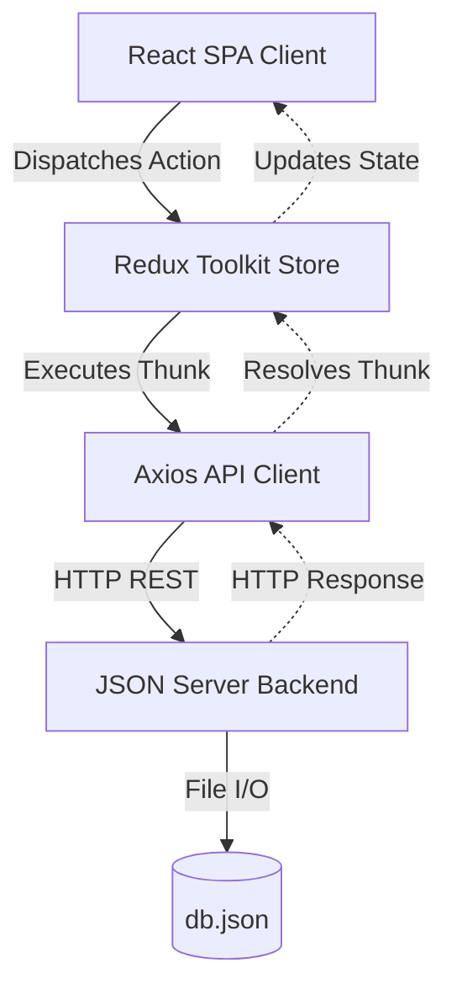
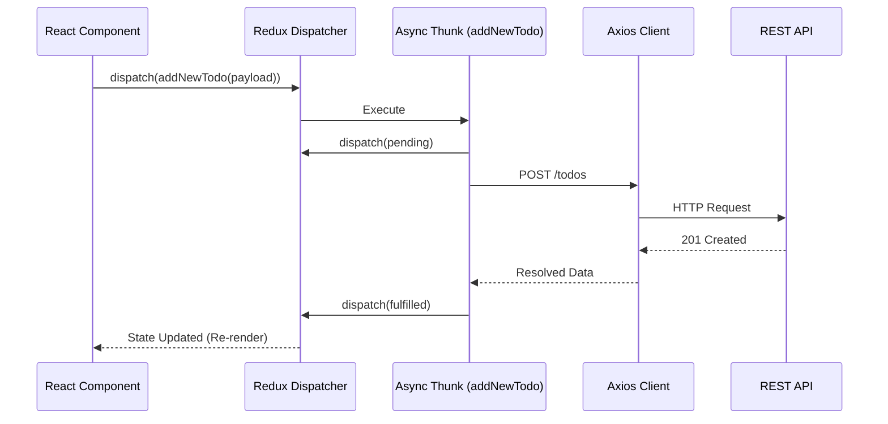

# Task Management Client

**A production-ready, minimalist task management UI built for high-performance state synchronization.**

- **Version**: 1.0.0
- **Author**: Ashif EK
- **Tech Stack**: React 19, Vite, Redux Toolkit, Tailwind CSS v4, JSON Server
- **Status**: Production-Ready
- **Last Updated**: 2026-05-25

---

## 1. Executive Summary

### Business Problem
Task management tools often suffer from bloated interfaces, sluggish state updates, and inconsistent offline-to-online synchronization. Users require immediate feedback when creating, editing, or filtering tasks without waiting for network round-trips.

### Engineering Problem
Synchronizing complex local state (including Base64 image attachments) with a remote backend while maintaining a 60fps UI requires careful orchestration of asynchronous side effects, debouncing input streams, and handling race conditions.

### Why This Project Exists
`Task Management Client` serves as an enterprise-grade sandbox demonstrating how to properly architecture Redux Toolkit (RTK) async thunks, handle complex side-effects (throttling/debouncing via Lodash), and structure a scalable frontend monolith.

### Goals
- **Technical Goals**: Implement strict unidirectional data flow, decouple API integration from UI components, and maintain O(1) or O(log n) performance for state updates.
- **Scalability Goals**: Ensure the Redux slice can handle thousands of tasks locally via memoized selectors.
- **Security Goals**: Validate all inputs and sanitize Base64 payloads to prevent XSS.

---

## 2. System Overview

### High-Level Architecture
The system employs a standard Client-Server architecture. The frontend is a Single Page Application (SPA) powered by Vite and React, heavily leveraging Redux Toolkit for global state management. The backend is an ephemeral Node.js-based JSON Server acting as a lightweight REST API.

### Major Modules
- **UI Layer**: React components styled with Tailwind CSS v4.
- **State Management Layer**: Redux Toolkit `todosSlice` managing synchronous reducers and async thunks.
- **API Client Layer**: Axios-based singleton handling network requests.
- **Persistence Layer**: JSON Server writing to `db.json`.

### Data Flow
1. User interacts with UI (e.g., typing in search).
2. UI dispatches an action (debounced via Lodash).
3. Redux Thunk intercepts the action, transitioning state to `loading`.
4. API Client executes the network request.
5. On success, Thunk dispatches `fulfilled`, updating the Redux store.
6. Memoized selectors recompute, triggering a React re-render.

---

## 3. Architecture Diagrams

### System Architecture



### State Management Flow



---

## 4. Component & State Architecture

### Purpose
The frontend is architected to decouple view logic from business logic. Components should only read state via selectors and mutate state via dispatches.

### Internal Working
- **`todosSlice`**: Central source of truth. Handles `fetchTodos`, `addNewTodo`, `toggleTodoStatus`, `updateTodoText`, `deleteTodoItem`, and `clearCompletedTodos`.
- **Memoized Selectors**: Uses `selectFilteredTodos` and `selectStats` to prevent unnecessary re-renders. Computations like percentage completed are derived purely from the Redux state.

### Tradeoffs
Using Redux Toolkit for a relatively simple application introduces boilerplate. However, this tradeoff was explicitly chosen to demonstrate enterprise scalability. If this were a simple prototype, React Context or Zustand might have sufficed.

---

## 5. API Documentation

### REST Endpoints Overview
The application relies on a standard RESTful convention generated by `json-server`.

#### Fetch Todos
- **Endpoint**: `GET /todos`
- **Purpose**: Retrieve all task items.
- **Response**: `200 OK`
```json
[
  {
    "id": 1,
    "text": "Complete documentation",
    "completed": false,
    "image": "data:image/png;base64,..."
  }
]
```

#### Create Todo
- **Endpoint**: `POST /todos`
- **Purpose**: Create a new task.
- **Request Body**:
```json
{
  "text": "New task",
  "image": null,
  "completed": false
}
```

#### Update Todo
- **Endpoint**: `PATCH /todos/:id`
- **Purpose**: Partially update a task (text or status).
- **Request Body**:
```json
{
  "completed": true
}
```

#### Delete Todo
- **Endpoint**: `DELETE /todos/:id`
- **Purpose**: Remove a task.

---

## 6. Database Documentation

### Schema (`db.json`)
The schema is a flat, NoSQL-like JSON structure.

- **`todos` Collection**:
  - `id` (String/Integer): Unique identifier.
  - `text` (String): The task content.
  - `completed` (Boolean): Status of the task.
  - `image` (String, Optional): Base64 encoded image string.

### Scaling Considerations
Currently, storing Base64 images directly in `db.json` is highly inefficient and will bloat the file quickly. 
**Future Improvement**: Implement AWS S3 or Cloudinary for object storage, and save only the image URL in the database.

---

## 7. Security Documentation

### Current Posture
As a frontend-focused architecture sandbox, security layers are minimal.
- **XSS Prevention**: Handled natively by React's DOM escaping.
- **CORS**: Not strictly enforced in the ephemeral JSON server.

### Production Hardening Requirements
If transitioning this to a real backend:
1. **API Protection**: Implement JWT or Session-based authentication.
2. **Payload Validation**: The backend must validate that `text` is an actual string and strip HTML tags.
3. **Image Sanitization**: Base64 uploads must be validated against malicious payloads and restricted by file size (e.g., < 2MB).

---

## 8. Frontend Documentation

### Performance Optimization
- **Debouncing**: Search inputs are debounced via `lodash` to prevent firing Redux filter computations on every keystroke.
- **Throttling**: Rapid clicks on "Delete" or "Complete" are throttled.
- **CSS Architecture**: Tailwind CSS v4 is used for zero-runtime styling, ensuring optimal bundle size.

### Component Structure
- `features/todos`: Contains Redux slices and tightly coupled logic.
- `components/`: Pure presentation components.
- `api/client.js`: Singleton Axios instance.

---

## 9. Backend Documentation

### Ephemeral JSON Server
The backend is a simple `json-server` implementation meant purely to support frontend development.
- **Middleware**: Uses standard `json-server` defaults (logger, static, cors).
- **Limitations**: No transaction support, no relational constraints, no horizontal scalability.

---

## 10. DevOps Documentation

### Development Environment
```bash
# Start frontend
npm run dev

# Start backend
cd server && npm start
```

### Production Deployment
- **Frontend**: Deployable as a static site to Vercel, Netlify, or AWS S3.
- **Backend**: Render is currently used as the remote host for the JSON server.

---

## 11. Performance Documentation

### Bottlenecks
- **Large Base64 Payloads**: Pushing megabytes of Base64 strings through Redux serialization can cause memory spikes.
- **Optimization Strategy**: Migrate to Multipart Form Data uploads directly to an S3 bucket, bypassing Redux for the binary payload.

---

## 12. Error Handling Documentation

### Redux Error Boundaries
Thunks utilize standard `try/catch` and RTK's `.rejected` lifecycle action to push error messages into `state.todos.error`.

---

## 13. Testing Documentation

*(Testing suite is currently a placeholder for future implementation)*
- **Proposed Unit Tests**: Test Redux reducers and selectors using Jest.
- **Proposed E2E**: Use Playwright to simulate task creation and attachment uploads.

---

## 14. Project Structure

```
todo-redux-adv/
├── my-app/                 # Frontend React Application
│   ├── src/
│   │   ├── api/            # Axios client instances
│   │   ├── features/       # Redux slices (todosSlice)
│   │   ├── store.js        # RTK Store configuration
│   │   └── App.jsx         # Root layout
│   └── package.json
└── server/                 # Backend JSON Server
    ├── db.json             # Flat-file database
    └── server.js           # Server entry point
```

---

## 15. Engineering Decisions

### Why Redux Toolkit?
While React Context is simpler, RTK was chosen to demonstrate state predictability, easy integration with Redux DevTools, and structured handling of async side-effects via Thunks.

### Why Tailwind CSS v4?
Tailwind v4 introduces a new engine that drastically reduces build times and removes the need for extensive configuration files, making the project highly portable.

---

## 16. Advanced Engineering Insights

> [!WARNING]
> **Production Bottleneck Detected**
> The current architecture handles image uploads by encoding them as Base64 strings and passing them through the Redux store into the JSON database. 
> 
> **Impact**: As the database grows, the `fetchTodos` payload will become massive, leading to high TTFB (Time to First Byte) and potential browser memory exhaustion when RTK attempts to serialize thousands of Base64 strings.
> 
> **Resolution**: Implement signed URLs. The client should request an S3 pre-signed URL, upload the binary directly, and only store the S3 URL in the Redux state and Database.
