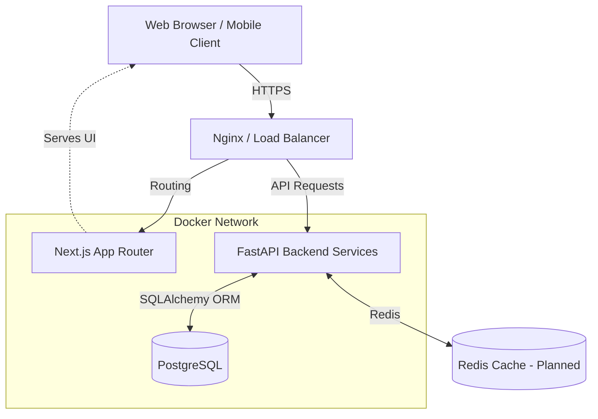
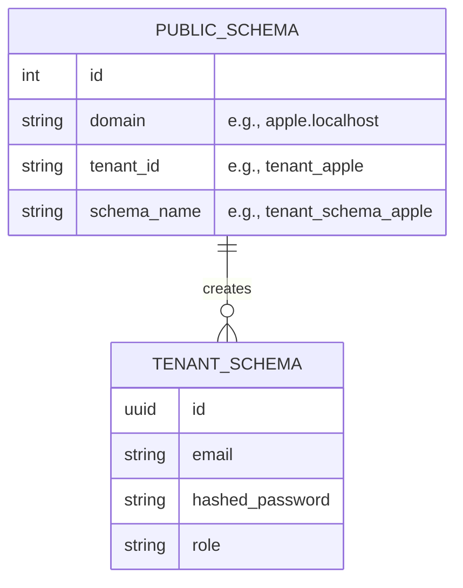
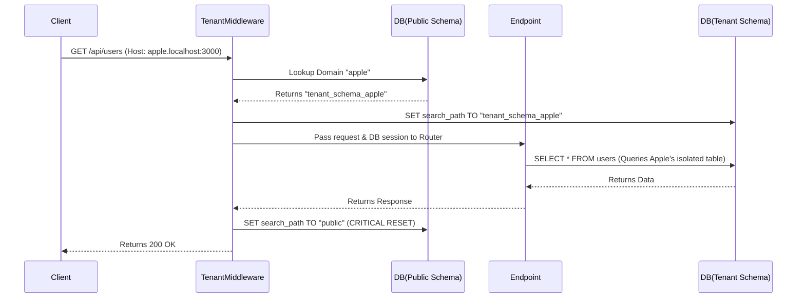
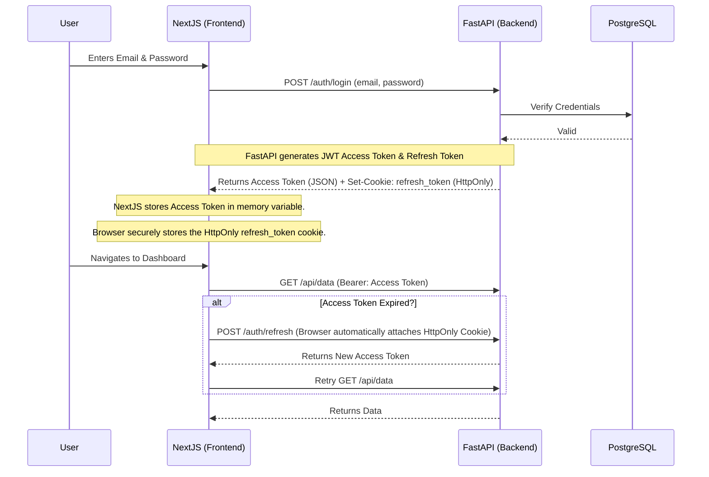
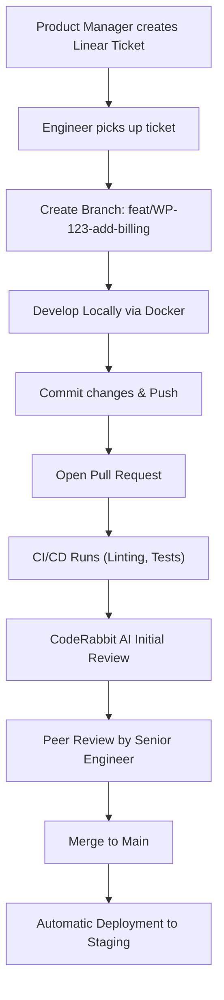

# WorkPilot Engineering Handbook

Welcome to the WorkPilot Engineering Handbook. This section provides an in-depth look at the architecture, design decisions, and internal mechanics of WorkPilot—a modern, multi-tenant SaaS application built for scale, security, and exceptional developer experience.

## 🔗 Important Links
* **Repository:** [GitHub Repository](https://github.com/work-pilot-org/work-pilot)
* **Wiki:** [Project Wiki](https://github.com/work-pilot-org/work-pilot/wiki)
* **Web Prototype:** [Stitch Web UI](https://stitch.withgoogle.com/preview/9691881107217269128?node-id=6d9461fa3a3346eeb70917ddc22b1ac7)
* **Mobile Prototype:** [Stitch Mobile UI](https://stitch.withgoogle.com/preview/1567494700365064952?node-id=133a2c697bd249c2900c174f5ec62418)

---

---

## 1. Executive Overview

### Project Vision
WorkPilot was conceived to solve the complexity of multi-tenant B2B applications. The vision was to build a secure, isolated workspace environment where different organizations (tenants) can operate simultaneously without any risk of data cross-contamination, while allowing the engineering team to maintain a single, unified codebase.

### Problem Statement
Most SaaS applications use a "shared database, shared schema" approach where a `tenant_id` column is added to every table. This approach is prone to catastrophic security bugs—a single forgotten `WHERE tenant_id = ?` clause can leak data between companies. WorkPilot solves this at the infrastructure level.

### Goals & Scope
- **Data Isolation:** Guarantee cryptographic and architectural data isolation between tenants.
- **Developer Experience (DevEx):** Provide seamless local development with hot-reloading for both backend and frontend inside Docker.
- **Scalability:** Ensure the architecture supports horizontal scaling and performance optimizations.
- **Security:** Implement modern security standards, discarding vulnerable patterns like storing JWTs in `localStorage`.

---

## 2. System Architecture

WorkPilot follows a decoupled client-server architecture. The backend acts as a headless API, consumed by a robust Next.js client.



### Component Relationships

1. **Client Layer:** Next.js (App Router) provides a highly optimized, server-rendered (where appropriate) UI. It uses TailwindCSS for styling and Axios for API communication.
2. **API Gateway / Routing:** (Future Design) A reverse proxy routes traffic based on subdomains (e.g., `apple.workpilot.com` vs. `api.workpilot.com`).
3. **Service Layer:** FastAPI handles all business logic, utilizing dependency injection for database sessions and current user context.
4. **Data Layer:** PostgreSQL acts as the primary data store, using a Schema-per-Tenant model to strictly enforce boundaries.

---

## Future Roadmap

- **Enterprise SSO (SAML/OIDC):** Seamless integration with Okta, Azure AD, and Google Workspace.
- **Redis Caching Layer:** Implementing distributed caching for tenant resolution and rate-limiting.
- **Microservice Extraction:** Extracting the Notification and Billing domains into independent services.
- **GraphQL / gRPC:** Exploring alternative communication protocols for inter-service communication.

---

This section documents the engineering rationale behind the core technologies and architectural patterns chosen for WorkPilot. Understanding these decisions is crucial for onboarding and future technical discussions.

---

## Why Microservices (or Service-Oriented Architecture)?

**Context:** The application needs to scale horizontally. Different domains (Auth, Billing, Core App) have different scaling profiles and security requirements.
**Decision:** We adopted a modular, service-oriented architecture (starting with a monolithic repository structured as logical microservices, e.g., `auth-service`).
**Trade-offs:** Increases deployment complexity but provides clean domain boundaries and allows teams to deploy independently in the future.

## Why FastAPI?

**Context:** We needed a high-performance backend framework capable of handling asynchronous I/O (essential for multi-tenant database routing).
**Decision:** Selected FastAPI (Python).
**Alternatives:** Django, Express (Node.js), Go.
**Trade-offs:** 
- *Pros:* Exceptional performance (ASGI), native Pydantic validation, automatic OpenAPI generation, type-hinting support.
- *Cons:* Smaller ecosystem compared to Django; requires strict architectural discipline to prevent code turning into a "big ball of mud."

## Why Next.js (App Router)?

**Context:** The frontend requires robust SEO for marketing pages, but a highly interactive, SPA-like feel for the dashboard.
**Decision:** Next.js 14+ utilizing the App Router.
**Alternatives:** React (Vite/CRA), Vue/Nuxt, SvelteKit.
**Trade-offs:**
- *Pros:* Server Components (RSC) reduce client bundle size; fantastic routing; strong ecosystem.
- *Cons:* Steeper learning curve for RSC vs. traditional React; complex caching mechanisms.

## Why SQLAlchemy & Alembic?

**Context:** We need a reliable ORM that supports advanced PostgreSQL features, specifically dynamic schema switching for multi-tenancy.
**Decision:** SQLAlchemy 2.0 with Alembic for migrations.
**Trade-offs:** SQLAlchemy is heavy and has a steep learning curve, but it provides unparalleled control over transactions and schema execution contexts.

## Why Schema-per-Tenant?

**Context:** B2B SaaS customers demand absolute data isolation.
**Decision:** PostgreSQL Schema-per-Tenant.
**Alternatives:** 
- *Database-per-tenant:* Too expensive and complex to orchestrate.
- *Shared-table (tenant_id column):* Too risky; one missing `WHERE` clause causes data leaks.
**Consequences:** Migrations (Alembic) must be run iteratively across all schemas. Connection pooling needs careful management to prevent cross-schema contamination on reused connections.

## Why HTTPOnly Cookies (Over localStorage)?

**Context:** Storing JWT access/refresh tokens in `localStorage` exposes them to Cross-Site Scripting (XSS) attacks. If an attacker injects a malicious script, they can steal tokens and hijack accounts.
**Decision:** Refresh tokens are stored in `HttpOnly`, `Secure`, `SameSite=None` cookies.
**Trade-offs:** Requires strict CORS configuration and makes cross-domain API calls slightly more complex, but drastically improves security posture.

## Why uv (Package Manager)?

**Context:** Python's standard `pip` or `poetry` can be slow, especially in Docker build steps.
**Decision:** Adopted `uv` by Astral.
**Trade-offs:** It's an incredibly fast, Rust-based package installer. The only downside is it's relatively new, but it significantly accelerates CI/CD and local build times.

---

Multi-tenancy is the architectural core of WorkPilot. To guarantee data privacy, WorkPilot uses a **Schema-per-Tenant** approach in PostgreSQL.

---

## 1. The Schema-per-Tenant Model

Instead of relying on a fragile `tenant_id` column in every table, WorkPilot creates a distinct PostgreSQL schema for every registered organization.



### Advantages
- **Cryptographic-level Isolation:** A query executed in `tenant_schema_apple` physically cannot read data from `tenant_schema_google`.
- **Backup & Restore:** We can easily backup or wipe a single tenant's data without affecting the rest of the database.
- **Scalability:** It strikes the perfect balance between the high cost of database-per-tenant and the high risk of shared-table models.

---

## 2. Request Lifecycle & Tenant Resolution

How does the backend know which database schema to query? This is handled dynamically via `TenantMiddleware`.



### Deep Dive: `TenantMiddleware` Implementation

The `TenantMiddleware` intercepts every request and performs the following:

1. **Session Creation:** Creates a single SQLAlchemy `SessionLocal` for the lifetime of the request.
2. **Resolution:** Extracts the subdomain from the `Host` header (e.g., `apple`).
3. **Lookup:** Queries the `public` schema's `Tenant` repository to find the associated `schema_name`.
4. **Schema Switch:** Executes `set_tenant_schema(db, schema_name)` which runs the PostgreSQL command: `SET search_path TO {schema_name}`.
5. **Execution:** Yields control to the FastAPI router.
6. **Cleanup:** In the `finally` block, it **MUST** reset the schema back to `public` before returning the connection to the SQLAlchemy connection pool.

> [!CAUTION]
> **Connection Pool Contamination**
> If the `TenantMiddleware` fails to reset the `search_path` back to `public` before the connection is returned to the pool, the next request that borrows that connection might accidentally query the wrong tenant's data. This is why the `finally` block in `tenant_middleware.py` containing `set_public_schema(db)` is absolutely critical.

---

## 3. Database Migrations (Alembic)

Because there are multiple schemas, running migrations is not a simple `alembic upgrade head`.

*(Future Design / Implementation Note)*: The Alembic migration scripts must be designed to loop over all tenant schemas dynamically. When a new migration is generated, it applies to the `public` schema first, and then iterates through every tenant schema executing the DDL commands.

---

Security is a primary concern in a multi-tenant SaaS. WorkPilot implements a secure authentication flow utilizing JSON Web Tokens (JWT) combined with strict Cookie policies, mitigating common XSS and CSRF vulnerabilities.

---

## 1. Authentication Lifecycle

### The Problem with `localStorage`
Many SPA (Single Page Applications) store JWTs in `localStorage`. This is highly vulnerable to Cross-Site Scripting (XSS). If a malicious script runs on the page, it can read `localStorage` and exfiltrate the tokens.

### The WorkPilot Solution: HTTPOnly Cookies
WorkPilot stores the long-lived `refresh_token` in an `HttpOnly`, `Secure`, `SameSite=None` cookie. The frontend cannot access this cookie via JavaScript. The short-lived `access_token` is kept entirely in memory (React state) and is never persisted to disk.



---

## 2. Multi-Factor Authentication (TOTP)

WorkPilot supports Time-Based One-Time Passwords (TOTP) (e.g., Google Authenticator, Authy).

**MFA Lifecycle:**
1. **Setup (`/auth/mfa/setup`):** Backend generates a TOTP secret, stores it temporarily, and returns a QR code (Provisioning URI).
2. **Enable (`/auth/mfa/enable`):** User submits a 6-digit code to verify they scanned the QR code successfully.
3. **Login (`/auth/login`):** If MFA is enabled, the backend returns a `PreAuthResponse` instead of tokens.
4. **MFA Login (`/auth/login/mfa`):** The frontend submits the pre-auth token and the 6-digit code to finally receive the real JWTs.

---

## 3. Authorization & RBAC

*(Future Design / Implementation Note)*
Role-Based Access Control (RBAC) is enforced at the database and middleware levels. 

- Users belong to specific Roles (e.g., `Admin`, `Editor`, `Viewer`).
- Roles map to specific Permissions (e.g., `projects:write`, `billing:read`).
- A FastAPI dependency `require_permissions("projects:write")` checks the JWT payload before executing the endpoint.

---

## 4. Security Defenses

- **Rate Limiting:** A custom `RateLimitMiddleware` limits requests (e.g., 60 per minute per IP) to prevent brute-force attacks on the `/auth/login` endpoints.
- **CORS:** Cross-Origin Resource Sharing is strictly bound to verified tenant subdomains (`allow_origin_regex=r"http://.*\.localhost:3000"`).
- **Password Hashing:** `bcrypt` or `argon2` is used for securely hashing passwords before they touch the database.
- **Token Rotation:** Refresh tokens can be rotated or blacklisted upon logout to immediately revoke access.

---

The backend of WorkPilot is engineered using **FastAPI** (Python). It is structured using a Domain-Driven Design (DDD) approach, ensuring business logic is decoupled from HTTP transport layers.

---

## 1. Directory Structure

The `auth-service` (the core backend service) is organized as follows:

```text
auth-service/
├── src/
│   ├── core/              # Global configurations, environment variables, base exceptions
│   ├── infrastructure/    # DB connection pools, Middlewares (Tenant, RateLimit)
│   ├── modules/           # Domain logic (Auth, Users, Tenant, Employee)
│   │   ├── auth/
│   │   │   ├── router.py  # HTTP Endpoints (FastAPI)
│   │   │   ├── service.py # Business Logic
│   │   │   ├── schemas.py # Pydantic Validation Models
│   │   │   └── repository.py # Database Operations (SQLAlchemy)
│   └── main.py            # FastAPI Application Entrypoint
```

### Why this structure?
By separating `router.py` (Transport) from `service.py` (Business Logic) and `repository.py` (Data Access), the application becomes highly testable. You can unit test the `AuthService` without needing to spin up a FastAPI test client or an actual HTTP server.

---

## 2. The Dependency Injection Graph

FastAPI relies heavily on Dependency Injection (`Depends()`). This is used extensively to manage database sessions and authenticate users.

```python
@router.get("/me")
def get_current_user_info(
    current_user: dict = Depends(get_current_user_and_set_schema),
    db: Session = Depends(get_db)
):
    return {"user": current_user}
```

**`get_db`**: Yields a database session from the `request.state.db` (created by the `TenantMiddleware`), ensuring the endpoint uses the exact same transaction context.
**`get_current_user_and_set_schema`**: Extracts the Bearer token, validates the JWT signature, checks expiration, and returns the user payload.

---

## 3. Microservices & Domain Boundaries

Currently, WorkPilot operates as a "Modular Monolith". All domains (Auth, Users, Tenants) live within the `auth-service` codebase, but are strictly separated by folder (`src/modules/*`).

*(Future Design)*
As the engineering team grows, the codebase is designed so that `src/modules/billing` could be easily extracted into a completely separate `billing-service` running in a different Docker container, communicating via gRPC or message queues (RabbitMQ/Kafka).

---

## 4. Performance & Caching

- **Database Connection Pooling:** SQLAlchemy's `QueuePool` is used to manage connections efficiently across the uvicorn workers.
- **Async Processing:** While SQLAlchemy 2.0 supports async, the core logic currently utilizes thread-pools for blocking operations, handled seamlessly by FastAPI's `def` vs `async def` routing.
- **Future Caching:** Redis is planned for caching frequent read-heavy operations, such as Tenant resolution in the middleware.

---

The WorkPilot client is a modern web application built with **Next.js (App Router)** and **TypeScript**. It is designed to be highly responsive, typesafe, and easy to maintain.

---

## 1. Directory Organization

The Next.js frontend utilizes the App Router paradigm, strictly separating UI components from API integration logic.

```text
frontend/
├── app/                  # Next.js App Router (Pages, Layouts, Routing)
│   ├── (auth)/           # Route group for Login/Register (No Dashboard Layout)
│   ├── tenant/           # Tenant Dashboard Routes
│   ├── layout.tsx        # Global Layout
│   └── page.tsx          # Landing Page
├── components/           # Reusable React UI Components
│   ├── ui/               # Base design system components (Buttons, Inputs)
│   └── auth/             # Domain-specific components (LoginForm)
├── lib/                  # Utilities, Axios instances, Types
└── use-cases/            # API Integration Layer (React Query / Axios calls)
```

---

## 2. API Integration Layer (`use-cases`)

Instead of making `axios.get()` calls directly inside React components, all API calls are abstracted into the `use-cases` directory.

### Why?
1. **Reusability:** The `loginUser` function can be used in the LoginForm component, or in an end-to-end testing script.
2. **Separation of Concerns:** Components shouldn't care *how* data is fetched, only how to render it.

### Axios Interceptors & Credentials
The core Axios instance is configured with `withCredentials: true`. This is vital. It tells the browser to automatically attach the `HttpOnly` refresh token cookie to outgoing requests made to the FastAPI backend.

Furthermore, an Axios Interceptor is configured to intercept `401 Unauthorized` responses. If a request fails due to an expired access token, the interceptor automatically calls the `/auth/refresh` endpoint (which uses the HttpOnly cookie), gets a new access token, and transparently retries the original failed request.

---

## 3. State Management & Validation

- **Form Validation:** WorkPilot uses **Zod** paired with **React Hook Form**. This provides robust, end-to-end type safety. The Zod schemas on the frontend often mirror the Pydantic schemas on the backend, ensuring data integrity before the request even leaves the browser.
- **Global State:** (Future Design) For complex state sharing across distant components (like user profile data or theme preferences), lightweight state managers like Zustand or React Context are utilized over heavier solutions like Redux.

---

## 4. The UI / UX Layer

- **TailwindCSS:** Utility-first styling is used exclusively. It prevents CSS bundle bloat and keeps styling collocated with the component logic.
- **Shadcn UI (or similar):** Base components are built to be accessible (ARIA compliant) and highly customizable.

---

WorkPilot is designed to provide a frictionless local development experience. A new engineer should be able to clone the repository and have the entire stack running locally in under 3 minutes, entirely via Docker.

---

## 1. Local Infrastructure (Docker Compose)

The entire local development environment is orchestrated via a single `docker-compose.yml` file.

```yaml
services:
  postgres:
    image: postgres:16
    # ...
  auth-service:
    build: ./auth-service
    command: sh -c "uv run alembic upgrade head && uv run uvicorn src.main:app --reload"
  frontend:
    build: ./frontend
    command: npm run dev
```

### Hot-Reloading in Docker
Hot-reloading is notoriously difficult to configure correctly inside Docker, especially on Windows/Mac hosts due to filesystem events not propagating properly to the Linux containers.

**The Solution:**
- For **Next.js**, we use CHOKIDAR polling via environment variables:
  ```env
  WATCHPACK_POLLING=true
  CHOKIDAR_USEPOLLING=true
  ```
- For **FastAPI**, we mount the host's `./auth-service` directory directly into the container using Volumes. Uvicorn's `--reload` flag monitors this mounted volume and restarts the ASGI server upon any code change.

---

## 2. The Ideal Developer Workflow

WorkPilot engineers follow a standardized lifecycle from ticket creation to deployment.



---

## 3. Engineering Journal: Problems Encountered

Documenting our failures is just as important as documenting our successes. Here are major engineering hurdles we faced and how we solved them.

### Issue: Multi-Tenant Middleware Connection Leaks
**Problem:** Initially, if a request threw an exception inside a specific tenant's schema, the subsequent request from a completely different user might accidentally read from the previous tenant's schema.
**Root Cause:** The `TenantMiddleware` was not properly resetting the PostgreSQL `search_path` back to `public` in the event of an unhandled exception before the SQLAlchemy connection was returned to the connection pool.
**Solution:** Wrapped the schema reset logic in a strict `finally` block with a `db.rollback()` safety net before `set_public_schema(db)`.

### Issue: Safari ITP & Cross-Origin Cookies
**Problem:** The `HttpOnly` refresh token cookies were not being attached to backend requests when testing on Safari browsers.
**Root Cause:** Apple's Intelligent Tracking Prevention (ITP) aggressively blocks third-party cookies. Because the local frontend was running on `localhost:3000` and the backend on `localhost:8000`, Safari considered them third-party despite the same domain name.
**Solution:** We enforced strict subdomain routing during development (e.g., `tenant.localhost:3000`) and properly set `samesite="none"` and `secure=True` (even locally, necessitating local HTTPS certificates or accepting HTTP exceptions for localhost).

---

## 4. Contribution Guidelines

- **Branch Naming:** `feat/<ticket-id>-<short-desc>`, `bug/<ticket-id>-<short-desc>`, `chore/<short-desc>`
- **Commit Messages:** Follow Conventional Commits format (e.g., `feat(auth): implement TOTP validation`).
- **Code Reviews:** All PRs require at least one approval from a peer. Do not merge your own PRs. Ensure all CI checks (type checking, linting, tests) pass before requesting review.

---

