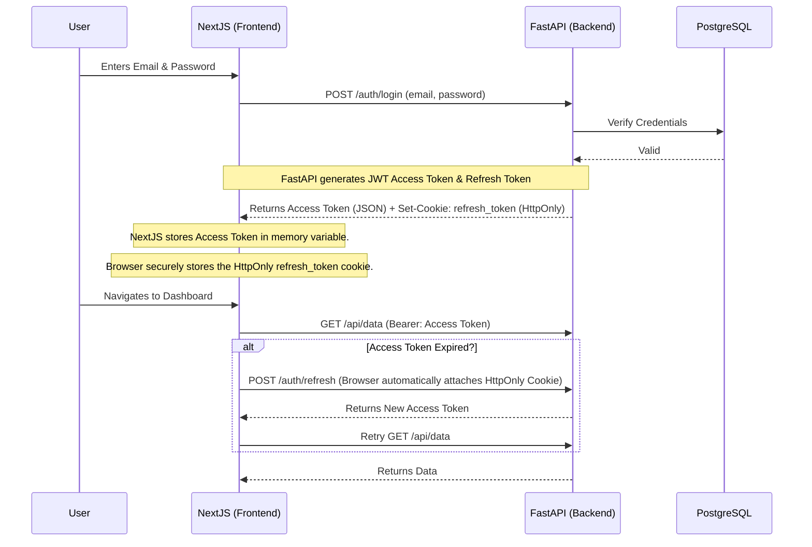

# Authentication & Security

Security is a primary concern in a multi-tenant SaaS. WorkPilot implements a secure authentication flow utilizing JSON Web Tokens (JWT) combined with strict Cookie policies, mitigating common XSS and CSRF vulnerabilities.

---

## 1. Authentication Lifecycle

### The Problem with `localStorage`
Many SPA (Single Page Applications) store JWTs in `localStorage`. This is highly vulnerable to Cross-Site Scripting (XSS). If a malicious script runs on the page, it can read `localStorage` and exfiltrate the tokens.

### The WorkPilot Solution: HTTPOnly Cookies
WorkPilot stores the long-lived `refresh_token` in an `HttpOnly`, `Secure`, `SameSite=None` cookie. The frontend cannot access this cookie via JavaScript. The short-lived `access_token` is kept entirely in memory (React state) and is never persisted to disk.

---

## 2. Multi-Factor Authentication (TOTP)

WorkPilot supports Time-Based One-Time Passwords (TOTP) (e.g., Google Authenticator, Authy).

**MFA Lifecycle:**
1. **Setup (`/auth/mfa/setup`):** Backend generates a TOTP secret, stores it temporarily, and returns a QR code (Provisioning URI).
2. **Enable (`/auth/mfa/enable`):** User submits a 6-digit code to verify they scanned the QR code successfully.
3. **Login (`/auth/login`):** If MFA is enabled, the backend returns a `PreAuthResponse` instead of tokens.
4. **MFA Login (`/auth/login/mfa`):** The frontend submits the pre-auth token and the 6-digit code to finally receive the real JWTs.

---

## 3. Authorization & RBAC

*(Future Design / Implementation Note)*
Role-Based Access Control (RBAC) is enforced at the database and middleware levels. 

- Users belong to specific Roles (e.g., `Admin`, `Editor`, `Viewer`).
- Roles map to specific Permissions (e.g., `projects:write`, `billing:read`).
- A FastAPI dependency `require_permissions("projects:write")` checks the JWT payload before executing the endpoint.

---

## 4. Security Defenses

- **Rate Limiting:** A custom `RateLimitMiddleware` limits requests (e.g., 60 per minute per IP) to prevent brute-force attacks on the `/auth/login` endpoints.
- **CORS:** Cross-Origin Resource Sharing is strictly bound to verified tenant subdomains (`allow_origin_regex=r"http://.*\.localhost:3000"`).
- **Password Hashing:** `bcrypt` or `argon2` is used for securely hashing passwords before they touch the database.
- **Token Rotation:** Refresh tokens can be rotated or blacklisted upon logout to immediately revoke access.
