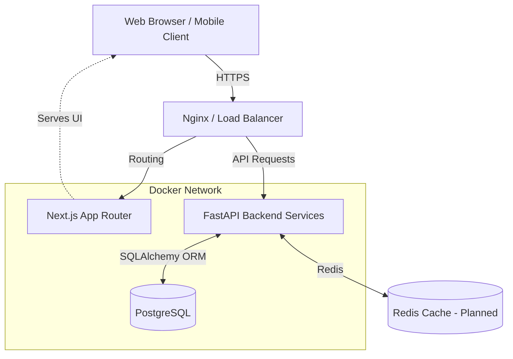

# WorkPilot Engineering Handbook

Welcome to the WorkPilot Engineering Handbook. This section provides an in-depth look at the architecture, design decisions, and internal mechanics of WorkPilot—a modern, multi-tenant SaaS application built for scale, security, and exceptional developer experience.

---

## 1. Executive Overview

### Project Vision
WorkPilot was conceived to solve the complexity of multi-tenant B2B applications. The vision was to build a secure, isolated workspace environment where different organizations (tenants) can operate simultaneously without any risk of data cross-contamination, while allowing the engineering team to maintain a single, unified codebase.

### Problem Statement
Most SaaS applications use a "shared database, shared schema" approach where a `tenant_id` column is added to every table. This approach is prone to catastrophic security bugs—a single forgotten `WHERE tenant_id = ?` clause can leak data between companies. WorkPilot solves this at the infrastructure level.

### Goals & Scope
- **Data Isolation:** Guarantee cryptographic and architectural data isolation between tenants.
- **Developer Experience (DevEx):** Provide seamless local development with hot-reloading for both backend and frontend inside Docker.
- **Scalability:** Ensure the architecture supports horizontal scaling and performance optimizations.
- **Security:** Implement modern security standards, discarding vulnerable patterns like storing JWTs in `localStorage`.

---

## 2. System Architecture

WorkPilot follows a decoupled client-server architecture. The backend acts as a headless API, consumed by a robust Next.js client.

### Component Relationships

1. **Client Layer:** Next.js (App Router) provides a highly optimized, server-rendered (where appropriate) UI. It uses TailwindCSS for styling and Axios for API communication.
2. **API Gateway / Routing:** (Future Design) A reverse proxy routes traffic based on subdomains (e.g., `apple.workpilot.com` vs. `api.workpilot.com`).
3. **Service Layer:** FastAPI handles all business logic, utilizing dependency injection for database sessions and current user context.
4. **Data Layer:** PostgreSQL acts as the primary data store, using a Schema-per-Tenant model to strictly enforce boundaries.

---

## Future Roadmap

- **Enterprise SSO (SAML/OIDC):** Seamless integration with Okta, Azure AD, and Google Workspace.
- **Redis Caching Layer:** Implementing distributed caching for tenant resolution and rate-limiting.
- **Microservice Extraction:** Extracting the Notification and Billing domains into independent services.
- **GraphQL / gRPC:** Exploring alternative communication protocols for inter-service communication.
