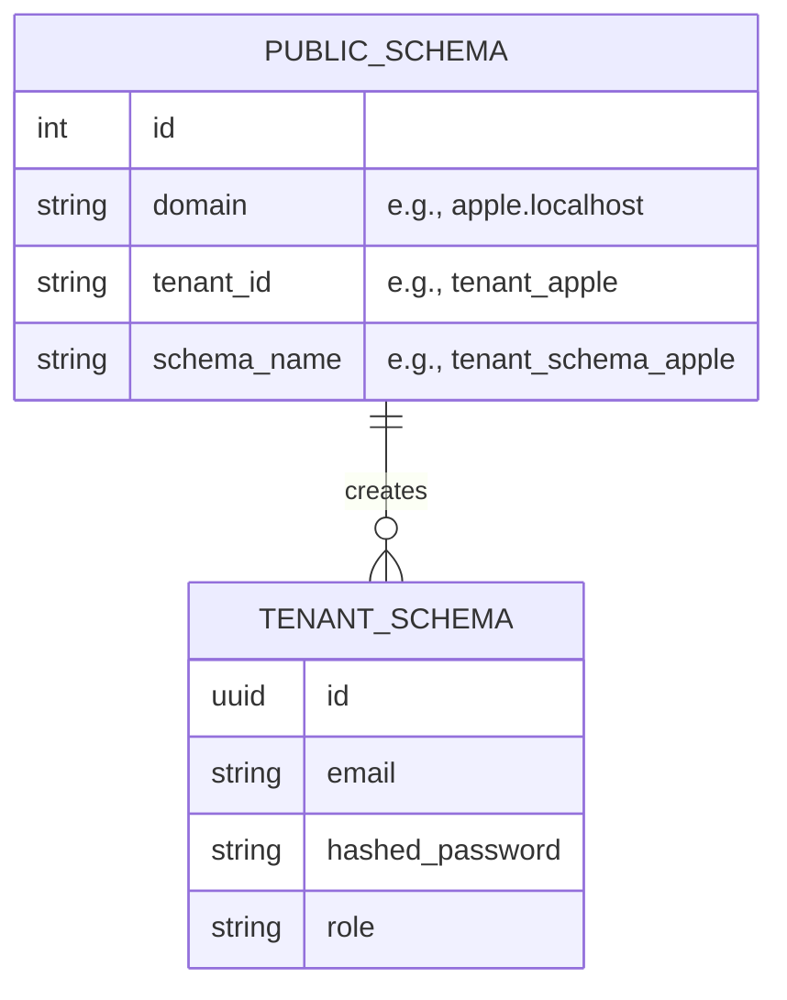
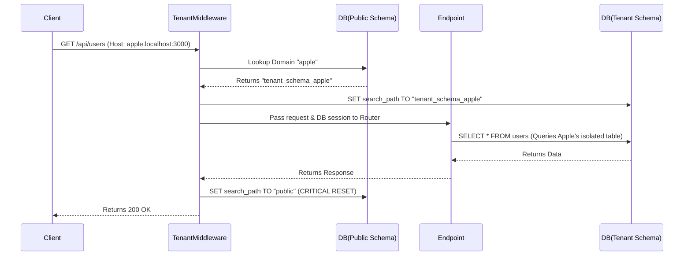

# Multi-Tenant Architecture

Multi-tenancy is the architectural core of WorkPilot. To guarantee data privacy, WorkPilot uses a **Schema-per-Tenant** approach in PostgreSQL.

---

## 1. The Schema-per-Tenant Model

Instead of relying on a fragile `tenant_id` column in every table, WorkPilot creates a distinct PostgreSQL schema for every registered organization.

### Advantages
- **Cryptographic-level Isolation:** A query executed in `tenant_schema_apple` physically cannot read data from `tenant_schema_google`.
- **Backup & Restore:** We can easily backup or wipe a single tenant's data without affecting the rest of the database.
- **Scalability:** It strikes the perfect balance between the high cost of database-per-tenant and the high risk of shared-table models.

---

## 2. Request Lifecycle & Tenant Resolution

How does the backend know which database schema to query? This is handled dynamically via `TenantMiddleware`.

### Deep Dive: `TenantMiddleware` Implementation

The `TenantMiddleware` intercepts every request and performs the following:

1. **Session Creation:** Creates a single SQLAlchemy `SessionLocal` for the lifetime of the request.
2. **Resolution:** Extracts the subdomain from the `Host` header (e.g., `apple`).
3. **Lookup:** Queries the `public` schema's `Tenant` repository to find the associated `schema_name`.
4. **Schema Switch:** Executes `set_tenant_schema(db, schema_name)` which runs the PostgreSQL command: `SET search_path TO {schema_name}`.
5. **Execution:** Yields control to the FastAPI router.
6. **Cleanup:** In the `finally` block, it **MUST** reset the schema back to `public` before returning the connection to the SQLAlchemy connection pool.

> [!CAUTION]
> **Connection Pool Contamination**
> If the `TenantMiddleware` fails to reset the `search_path` back to `public` before the connection is returned to the pool, the next request that borrows that connection might accidentally query the wrong tenant's data. This is why the `finally` block in `tenant_middleware.py` containing `set_public_schema(db)` is absolutely critical.

---

## 3. Database Migrations (Alembic)

Because there are multiple schemas, running migrations is not a simple `alembic upgrade head`.

*(Future Design / Implementation Note)*: The Alembic migration scripts must be designed to loop over all tenant schemas dynamically. When a new migration is generated, it applies to the `public` schema first, and then iterates through every tenant schema executing the DDL commands.
