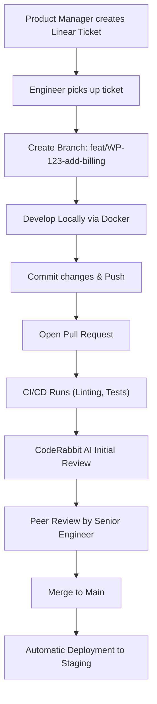

# Docker & Developer Workflow

WorkPilot is designed to provide a frictionless local development experience. A new engineer should be able to clone the repository and have the entire stack running locally in under 3 minutes, entirely via Docker.

---

## 1. Local Infrastructure (Docker Compose)

The entire local development environment is orchestrated via a single `docker-compose.yml` file.

```yaml
services:
  postgres:
    image: postgres:16
    # ...
  auth-service:
    build: ./auth-service
    command: sh -c "uv run alembic upgrade head && uv run uvicorn src.main:app --reload"
  frontend:
    build: ./frontend
    command: npm run dev
```

### Hot-Reloading in Docker
Hot-reloading is notoriously difficult to configure correctly inside Docker, especially on Windows/Mac hosts due to filesystem events not propagating properly to the Linux containers.

**The Solution:**
- For **Next.js**, we use CHOKIDAR polling via environment variables:
  ```env
  WATCHPACK_POLLING=true
  CHOKIDAR_USEPOLLING=true
  ```
- For **FastAPI**, we mount the host's `./auth-service` directory directly into the container using Volumes. Uvicorn's `--reload` flag monitors this mounted volume and restarts the ASGI server upon any code change.

---

## 2. The Ideal Developer Workflow

WorkPilot engineers follow a standardized lifecycle from ticket creation to deployment.



---

## 3. Engineering Journal: Problems Encountered

Documenting our failures is just as important as documenting our successes. Here are major engineering hurdles we faced and how we solved them.

### Issue: Multi-Tenant Middleware Connection Leaks
**Problem:** Initially, if a request threw an exception inside a specific tenant's schema, the subsequent request from a completely different user might accidentally read from the previous tenant's schema.
**Root Cause:** The `TenantMiddleware` was not properly resetting the PostgreSQL `search_path` back to `public` in the event of an unhandled exception before the SQLAlchemy connection was returned to the connection pool.
**Solution:** Wrapped the schema reset logic in a strict `finally` block with a `db.rollback()` safety net before `set_public_schema(db)`.

### Issue: Safari ITP & Cross-Origin Cookies
**Problem:** The `HttpOnly` refresh token cookies were not being attached to backend requests when testing on Safari browsers.
**Root Cause:** Apple's Intelligent Tracking Prevention (ITP) aggressively blocks third-party cookies. Because the local frontend was running on `localhost:3000` and the backend on `localhost:8000`, Safari considered them third-party despite the same domain name.
**Solution:** We enforced strict subdomain routing during development (e.g., `tenant.localhost:3000`) and properly set `samesite="none"` and `secure=True` (even locally, necessitating local HTTPS certificates or accepting HTTP exceptions for localhost).

---

## 4. Contribution Guidelines

- **Branch Naming:** `feat/<ticket-id>-<short-desc>`, `bug/<ticket-id>-<short-desc>`, `chore/<short-desc>`
- **Commit Messages:** Follow Conventional Commits format (e.g., `feat(auth): implement TOTP validation`).
- **Code Reviews:** All PRs require at least one approval from a peer. Do not merge your own PRs. Ensure all CI checks (type checking, linting, tests) pass before requesting review.
